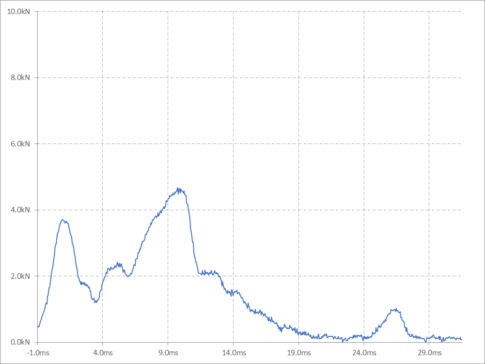

    Const START_OFFSET As Long = 16
    Const START_EXTENSION As Long = 52
    Const END_EXTENSION As Long = 850
    でグラフ範囲を決めていますが、この範囲をもっと動的にしたいです。
    グラフが表す数値はある一定の値の間を取ったあとに、激しく変化します。その激しく変化した時点からグラフの描画を開始し、また一定の値の間を取り出したらグラフの描画を終了したいです。
    複雑な処理になるので、段階的に進めるためにまずはマクロを作成する工程を示してください。

どうもこの方法ではうまくいかないようです。隣接した値を比較したのですが、隣接した部分ではどの部分も差分が小さいためです。アプローチを以下のように変更します。
# アプローチ
- 捜査する範囲で最も高い値 top_Value を見つけます。
- top_Valueから左右の値を捜査して0より小さな値を示す、top_Valueの列から最も近い列を見つけます。
- その列をグラフの開始列と終了列にします。

```vb
Function FindGraphRangeByTopValue(ws As Worksheet, row As Long) As Variant
    Dim lastCol As Long, maxValCol As Long, i As Long
    Dim startCol As Long, endCol As Long
    Dim maxVal As Double

    ' 特定行の最後の列を見つける
    lastCol = ws.Cells(row, ws.Columns.Count).End(xlToLeft).Column

    ' 最大値とその位置を見つける
    maxVal = Application.WorksheetFunction.Max(ws.Range(ws.Cells(row, 1), ws.Cells(row, lastCol)))
    For i = 1 To lastCol
        If ws.Cells(row, i).Value = maxVal Then
            maxValCol = i
            Exit For
        End If
    Next i

    ' 左側の負の値を探す
    For i = maxValCol To 1 Step -1
        If ws.Cells(row, i).Value < 0 Then
            startCol = i + 1
            Exit For
        End If
    Next i

    ' 右側の負の値を探す
    For i = maxValCol To lastCol
        If ws.Cells(row, i).Value < 0 Then
            endCol = i - 1
            Exit For
        End If
    Next i

    ' 開始列と終了列を返す
    FindGraphRangeByTopValue = Array(startCol, endCol)
End Function


Function ColNumToLetter(colNum As Integer) As String
    'CreateGraphHelmetに使用する関数。
    Dim d As Integer, m As Integer, name As String
    d = colNum
    name = ""
    While d > 0
        m = (d - 1) Mod 26
        name = Chr(65 + m) & name
        d = Int((d - m) / 26)
    Wend
    ColNumToLetter = name
End Function

Sub CreateGraphHelmet()

    Const START_OFFSET As Long = 16
    Const START_EXTENSION As Long = 52
    Const END_EXTENSION As Long = 850

    Dim ws As Worksheet
    Set ws = ThisWorkbook.Sheets("LOG_Helmet")

    Dim lastRow As Long
    Dim lastCol As Long
    lastRow = ws.Cells(ws.Rows.Count, "B").End(xlUp).row
    lastCol = ws.Cells(1, ws.Columns.Count).End(xlToLeft).Column

    Dim colStart As String
    Dim colEnd As String

    colStart = ColNumToLetter(START_OFFSET + START_EXTENSION)
    colEnd = ColNumToLetter(START_OFFSET + END_EXTENSION)

    Dim chartLeft As Long
    Dim chartTop As Long
    chartTop = ws.Rows(lastRow).Height - 20
    chartLeft = 250

    For i = 2 To lastRow
        CreateIndividualChart ws, i, chartLeft, chartTop, colStart, colEnd
        chartLeft = chartLeft + 10
    Next i

End Sub
```
以上のグラフ作成のプロシージャを改変したい。
START_EXTENSION, Const END_EXTENSIONを
    Dim colStart As String
    Dim colEnd As String
    colStart = "BP"
    colEnd = "AGH"
などで行ったようにセルの列の値を指定することでグラフの始点と終点を定義できるようにしてください。


アプローチを変更します。V1からAX2までの範囲を選択し、折れ線グラフを作ります。そのグラフに対して縦横の目盛線を追加してください。
グラフは目盛線をサポートしている形式を選択してください。


以下の条件を満たすVBAのコードを作成してください。コードの目的は"Log_Helmet"シートから値を各シートに転記することです。
あなたはプロのVBAコーダーです。バックアップ環境は完全ですので失敗を恐れずチャレンジしてください。
プロシージャの名前は英語で目的に沿うものにしてください。
# 条件
- "Log_Helmet"シートのE列の値が"天頂"である場合"Impact_Top"シートに転記する。
- "Log_Helmet"シートのL列の値が"高温"である場合C列に転記する。
- "Log_Helmet"シートのB列の値の最後が"1"で終わっている場合、C6に転記する。
- "Log_Helmet"シートのE列は他に天頂、前頭部、後頭部、側頭部があり、それぞれ違うシートに転記したい。
- "Log_Helmet"シートのL列の値は他に 高温、低温、浸せきがあり、それぞれ違う列に転記したい。
- "Log_Helmet"シートのB列の値の最後は他に 1, 2, 3 で終わっていて、それぞれ違う行に転記したい。

```vb
Sub TransferHelmetLogData()
    Dim wsLog As Worksheet, wsImpactTop As Worksheet, wsImpactFront As Worksheet, wsImpactBack As Worksheet, wsImpactSide As Worksheet, wsDestination As Worksheet
    Dim lastRow As Long, i As Long
    Dim destCol As Long, destRow As Long

    ' ワークシート設定
    Set wsLog = ThisWorkbook.Sheets("Log_Helmet")
    Set wsImpactTop = ThisWorkbook.Sheets("Impact_Top")
    Set wsImpactFront = ThisWorkbook.Sheets("Impact_Front")

    ' "Log_Helmet"シートの最終行を取得
    lastRow = wsLog.Cells(wsLog.Rows.Count, "A").End(xlUp).Row

    ' データを行ごとに確認
    For i = 1 To lastRow
        ' E列が"天頂"の場合
        If wsLog.Cells(i, "E").Value = "天頂" Then
            wsImpactTop.Cells(i, "A").Value = wsLog.Cells(i, "A").Value ' 例: A列の値を転記
        End If

        ' L列の値による転記
        Select Case wsLog.Cells(i, "L").Value
            Case "高温"
                destCol = 3 ' C列
            Case "低温"
                destCol = 6 ' E列
            Case "浸せき"
                destCol = 5 ' G列
            Case Else
                destCol = 0
        End Select

        If destCol <> 0 Then
            wsLog.Cells(i, destCol).Value = wsLog.Cells(i, "A").Value ' 例: A列の値を転記
        End If

        ' B列の値の最後の数字による行の設定
        Select Case Right(wsLog.Cells(i, "B").Value, 1)
            Case "1"
                destRow = 6 ' 6行目
            Case "2"
                destRow = 7 ' 7行目
            Case "3"
                destRow = 8 ' 8行目
            Case Else
                destRow = 0
        End Select

        If destRow <> 0 Then
            wsLog.Cells(destRow, "C").Value = wsLog.Cells(i, "A").Value ' 例: A列の値を転記
        End If
    Next i

    ' リソースの解放
    Set wsLog = Nothing
    Set wsImpactTop = Nothing
End Sub

```
1行ずつ確認するのではなく、まずE列の値を精査して天頂なら"Impact_Top"シートに入れる値を決め、それからL列、B列の値によって振り分ける方法はどうでしょうか？
少し誤解があるようです。転記したい値は"Log_Helmet"のH列の値なのですが、それをどこに振り分けるかが問題です。
まずE列の値からシートが決定し、次にL列の値から列が決定し、最後にB列の最後の値から行を決定することで転記場所が決定されます。
このロジックでもう一度コードを作成してください。
```vb
Sub TransferDataBasedOnMultipleCriteria()
    Dim wsLog As Worksheet, wsDestination As Worksheet
    Dim lastRow As Long, i As Long
    Dim sheetName As String, destCol As Long, destRow As Long

    ' シートの初期設定
    Set wsLog = ThisWorkbook.Sheets("Log_Helmet")

    ' Log_Helmet シートの最終行を取得
    lastRow = wsLog.Cells(wsLog.Rows.Count, "B").End(xlUp).Row

    ' データを行ごとに処理
    For i = 1 To lastRow
        ' E列に基づいたシート名の決定
        Select Case wsLog.Cells(i, "E").Value
            Case "天頂"
                sheetName = "Impact_Top"
            Case "前頭部"
                sheetName = "Impact_Front"
            Case "後頭部"
                sheetName = "Impact_Back"
            Case "側頭部"
                sheetName = "Impact_Side"
            Case Else
                sheetName = ""
        End Select

        If sheetName <> "" Then
            Set wsDestination = ThisWorkbook.Sheets(sheetName)

            ' L列に基づいた列の決定
            Select Case wsLog.Cells(i, "L").Value
                Case "高温"
                    destCol = 3 ' C列
                Case "低温"
                    destCol = 5 ' E列
                Case "浸せき"
                    destCol = 6 ' G列
                Case Else
                    destCol = 0
            End Select

            If destCol <> 0 Then
                ' B列の最後の文字に基づいた行の決定
                Select Case Right(wsLog.Cells(i, "B").Value, 1)
                    Case "1"
                        destRow = 6
                    Case "2"
                        destRow = 8
                    Case "3"
                        destRow = 10
                    Case Else
                        destRow = 0
                End Select

                If destRow <> 0 Then
                    ' 値を適切な位置に転記
                    wsDestination.Cells(destRow, destCol).Value = wsLog.Cells(i, "H").Value
                End If
            End If
        End If
    Next i

    ' リソースの解放
    Set wsLog = Nothing
    Set wsDestination = Nothing
End Sub

"Impact_Top"シートと"Impact_Front"&"Impact_Back"そして"Impact_Side"シートの構造はそれぞれ違います。"Impact_Front"&"Impact_Back"は同じ構造です。合計3種類の構造の違うシートがあるので、それぞれにSelect Case wsLog.Cells(i, "L").Value以降を変化させたいです。

Sub TransferDataWithStructuredLogic()
    Dim wsLog As Worksheet, wsDestination As Worksheet
    Dim lastRow As Long, i As Long
    Dim sheetName As String, destCol As Long, destRow As Long

    ' シートの初期設定
    Set wsLog = ThisWorkbook.Sheets("Log_Helmet")

    ' Log_Helmet シートの最終行を取得
    lastRow = wsLog.Cells(wsLog.Rows.Count, "A").End(xlUp).Row

    ' データを行ごとに処理
    For i = 1 To lastRow
        ' E列に基づいたシート名の決定
        Select Case wsLog.Cells(i, "E").Value
            Case "天頂"
                sheetName = "Impact_Top"
            Case "前頭部", "後頭部"
                sheetName = "Impact_Front" ' 前頭部と後頭部は同じ構造
            Case "側頭部"
                sheetName = "Impact_Side"
            Case Else
                sheetName = ""
        End Select

        If sheetName <> "" Then
            Set wsDestination = ThisWorkbook.Sheets(sheetName)

            ' L列とシート構造に基づいた列の決定
            Select Case sheetName
                Case "Impact_Top"
                    Select Case wsLog.Cells(i, "L").Value
                        Case "高温"
                            destCol = 2 ' B列
                        Case "低温"
                            destCol = 3 ' C列
                        Case "浸せき"
                            destCol = 4 ' D列
                        Case Else
                            destCol = 0
                    End Select
                Case "Impact_Front", "Impact_Back"
                    Select Case wsLog.Cells(i, "L").Value
                        Case "高温"
                            destCol = 5 ' E列
                        Case "低温"
                            destCol = 6 ' F列
                        Case "浸せき"
                            destCol = 7 ' G列
                        Case Else
                            destCol = 0
                    End Select
                Case "Impact_Side"
                    Select Case wsLog.Cells(i, "L").Value
                        Case "高温"
                            destCol = 3 ' C列
                        Case "低温"
                            destCol = 4 ' D列
                        Case "浸せき"
                            destCol = 5 ' E列
                        Case Else
                            destCol = 0
                    End Select
            End Select

            ' B列の最後の文字に基づいた行の決定、シート構造に応じて
            If sheetName = "Impact_Top" Then
                Select Case Right(wsLog.Cells(i, "B").Value, 1)
                    Case "1"
                        destRow = 10
                    Case "2"
                        destRow = 11
                    Case "3"
                        destRow = 12
                    Case Else
                        destRow = 0
                End Select
            Else
                Select Case Right(wsLog.Cells(i, "B").Value, 1)
                    Case "1"
                        destRow = 6
                    Case "2"
                        destRow = 7
                    Case "3"
                        destRow = 8
                    Case Else
                        destRow = 0
                End Select
            End If

            If destCol <> 0 And destRow <> 0 Then
                ' 値を適切な位置に転記
                wsDestination.Cells(destRow, destCol).Value = wsLog.Cells(i, "H").Value
            End If
        End If
    Next i

    ' リソースの解放
    Set wsLog = Nothing
    Set wsDestination = Nothing
End Sub


Sub TransferDataWithDistinctSheets()
    Dim wsLog As Worksheet, wsDestination As Worksheet
    Dim lastRow As Long, i As Long
    Dim sheetName As String, destCol As Long, destRow As Long

    ' シートの初期設定
    Set wsLog = ThisWorkbook.Sheets("Log_Helmet")

    ' Log_Helmet シートの最終行を取得
    lastRow = wsLog.Cells(wsLog.Rows.Count, "A").End(xlUp).Row

    ' データを行ごとに処理
    For i = 1 To lastRow
        ' E列に基づいたシート名の決定
        Select Case wsLog.Cells(i, "E").Value
            Case "天頂"
                sheetName = "Impact_Top"
            Case "前頭部"
                sheetName = "Impact_Front"
            Case "後頭部"
                sheetName = "Impact_Back"
            Case "側頭部"
                sheetName = "Impact_Side"
            Case Else
                sheetName = ""
        End Select

        If sheetName <> "" Then
            Set wsDestination = ThisWorkbook.Sheets(sheetName)

            ' L列とシート構造に基づいた列の決定
            Select Case sheetName
                Case "Impact_Top","Impact_Front", "Impact_Back"
                    Select Case wsLog.Cells(i, "L").Value
                        Case "高温"
                            destCol = 3 ' C列
                        Case "低温"
                            destCol = 5 ' E列
                        Case "浸せき"
                            destCol = 7 ' G列
                        Case Else
                            destCol = 0
                    End Select
                Case "Impact_Side"
                    Select Case wsLog.Cells(i, "L").Value
                        Case "高温"
                            destCol = 5 ' E列
                        Case "低温"
                            destCol = 6 ' F列
                        Case "浸せき"
                            destCol = 7 ' G列
                        Case Else
                            destCol = 0
                    End Select
            End Select

            ' B列の最後の文字に基づいた行の決定、シート構造に応じて
            If sheetName = "Impact_Top" Then
                Select Case Right(wsLog.Cells(i, "B").Value, 1)
                    Case "1"
                        destRow = 6
                    Case "2"
                        destRow = 8
                    Case "3"
                        destRow = 10
                    Case Else
                        destRow = 0
                End Select
            Else
                Select Case Right(wsLog.Cells(i, "B").Value, 1)
                    Case "1"
                        destRow = 6
                    Case "2"
                        destRow = 9
                    Case "3"
                        destRow = 12
                    Case Else
                        destRow = 0
                End Select
            End If
            If destCol <> 0 And destRow <> 0 Then
                ' 値を適切な位置に転記
                wsDestination.Cells(destRow, destCol).Value = wsLog.Cells(i, "H").Value
            End If
        End If
    Next i

    ' リソースの解放
    Set wsLog = Nothing
    Set wsDestination = Nothing
End Sub


Sub TransferDataWithDistinctSheets()
    On Error GoTo ErrorHandler

    Dim wsLog As Worksheet, wsDestination As Worksheet
    Dim lastRow As Long, i As Long
    Dim sheetName As String, destCol As Long, destRow As Long

    ' シートの初期設定
    Set wsLog = ThisWorkbook.Sheets("Log_Helmet")

    ' Log_Helmet シートの最終行を取得
    lastRow = wsLog.Cells(wsLog.Rows.Count, "B").End(xlUp).Row

    ' データを行ごとに処理
    For i = 1 To lastRow
        ' E列に基づいたシート名の決定
        Select Case wsLog.Cells(i, "E").Value
            Case "天頂"
                sheetName = "Impact_Top"
            Case "前頭部"
                sheetName = "Impact_Front"
            Case "後頭部"
                sheetName = "Impact_Back"
            Case "側頭部"
                sheetName = "Impact_Side"
            Case Else
                sheetName = ""
        End Select

        If sheetName <> "" Then
            Set wsDestination = ThisWorkbook.Sheets(sheetName)

            ' L列とシート構造に基づいた列の決定
            Select Case sheetName
                Case "Impact_Top","Impact_Front", "Impact_Back"
                    Select Case wsLog.Cells(i, "L").Value
                        Case "高温"
                            destCol = 3 ' C列
                        Case "低温"
                            destCol = 5 ' E列
                        Case "浸せき"
                            destCol = 7 ' G列
                        Case Else
                            destCol = 0
                    End Select
                Case "Impact_Side"
                    Select Case wsLog.Cells(i, "L").Value
                        Case "高温"
                            destCol = 5 ' E列
                        Case "低温"
                            destCol = 6 ' F列
                        Case "浸せき"
                            destCol = 7 ' G列
                        Case Else
                            destCol = 0
                    End Select
            End Select

            ' B列の最後の文字に基づいた行の決定、シート構造に応じて
            If sheetName = "Impact_Top" Or sheetName = "Impact_Front" Or sheetName = "Impact_Back" Then
                Select Case Right(wsLog.Cells(i, "B").Value, 1)
                    Case "1"
                        destRow = 6
                    Case "2"
                        destRow = 8
                    Case "3"
                        destRow = 10
                    Case Else
                        destRow = 0
                End Select
            Else
                Select Case Right(wsLog.Cells(i, "B").Value, 1)
                    Case "1"
                        destRow = 6
                    Case "2"
                        destRow = 9
                    Case "3"
                        destRow = 12
                    Case Else
                        destRow = 0
                End Select
            End If
            If destCol <> 0 And destRow <> 0 Then
                ' 値を適切な位置に転記
                wsDestination.Cells(destRow, destCol).Value = wsLog.Cells(i, "H").Value
            End If
        End If
    Next i

CleanUp:
    ' リソースの解放
    Set wsLog = Nothing
    Set wsDestination = Nothing
    Exit Sub

ErrorHandler:
    MsgBox "Error " & Err.Number & ": " & Err.Description, vbCritical
    Resume CleanUp
End Sub
```
Impact_Topシートに加えて、Impact_Frontシートも加えたいです。


wsLog.Cells(i, "J").Value, wsLog.Cells(i, "K").Valueも同様のロジックで転記したい。
転記されるがわのシートの構造が変わったときに素早く適切な一を指定したい。また、コードが長いので短くする方法はないでしょうか？

```vb
Sub TransferDataWithDistinctSheets()
    On Error GoTo ErrorHandler

    Dim wsLog As Worksheet, wsDestination As Worksheet
    Dim lastRow As Long, i As Long, destCol As Long, destRow As Long
    Dim sheetName As String, impact As String

    ' Initialize sheet
    Set wsLog = ThisWorkbook.Sheets("Log_Helmet")
    lastRow = wsLog.Cells(wsLog.Rows.Count, "B").End(xlUp).Row

    ' Data processing for each row
    For i = 2 To lastRow
        sheetName = GetSheetName(wsLog.Cells(i, "E").Value)
        If sheetName <> "" Then
            Set wsDestination = ThisWorkbook.Sheets(sheetName)
            destCol = GetDestinationColumn(sheetName, wsLog.Cells(i, "L").Value)
            destRow = GetDestinationRow(sheetName, wsLog.Cells(i, "B").Value)

            ' Copy data if valid column and row
            If destCol <> 0 And destRow <> 0 Then
                ' Copy H column to the determined column
                CopyData wsLog, wsDestination, i, destRow, destCol, "H"

                ' Check and copy J only if it's numeric and >= 0.1
                If IsNumeric(wsLog.Cells(i, "J").Value) And wsLog.Cells(i, "J").Value >= 0.1 Then
                    Dim destColForJ As Long
                    ' Adjust destination column for J as needed, here using destCol + 1 as an example
                    destColForJ = destCol + 1
                    CopyData wsLog, wsDestination, i, destRow, destColForJ, "J"
                End If

                ' Check and copy K only if it's numeric and >= 0.1
                If IsNumeric(wsLog.Cells(i, "K").Value) And wsLog.Cells(i, "K").Value >= 0.1 Then
                    Dim destColForK As Long
                    ' Adjust destination column for K as needed, here using destCol + 2 as an example
                    destColForK = destCol + 2
                    CopyData wsLog, wsDestination, i, destRow, destColForK, "K"
                End If
            End If
    Next i

CleanUp:
    Set wsLog = Nothing
    Set wsDestination = Nothing
    Exit Sub

ErrorHandler:
    MsgBox "Error " & Err.Number & ": " & Err.Description, vbCritical
    Resume CleanUp
End Sub

Function GetSheetName(impact As String) As String
    Select Case impact
        Case "天頂部": GetSheetName = "Impact_Top"
        Case "前頭部": GetSheetName = "Impact_Front"
        Case "後頭部": GetSheetName = "Impact_Back"
        Case "側頭部": GetSheetName = "Impact_Side"
        Case Else: GetSheetName = ""
    End Select
End Function

Function GetDestinationColumn(sheetName As String, condition As String) As Long
    Dim cols As Object
    Set cols = CreateObject("Scripting.Dictionary")

    ' Define column mapping for each condition and sheet
    cols("Impact_Top高温") = 3
    cols("Impact_Top低温") = 5
    cols("Impact_Top浸せき") = 7
    cols("Impact_Side高温") = 5
    cols("Impact_Side低温") = 6
    cols("Impact_Side浸せき") = 7
    ' Add other mappings as necessary

    GetDestinationColumn = cols(sheetName & condition)
End Function

Function GetDestinationRow(sheetName As String, refVal As String) As Long
    ' This can be modified to use a similar mapping approach as columns
    Select Case Right(refVal, 1)
        Case "1", "4", "7": GetDestinationRow = 6
        Case "2", "5", "8": GetDestinationRow = 9
        Case "3", "6", "9": GetDestinationRow = 12
        Case Else: GetDestinationRow = 0
    End Select
End Function

Sub CopyData(wsSource As Worksheet, wsDest As Worksheet, sourceRow As Long, destRow As Long, destCol As Long, sourceCol As String)
    wsDest.Cells(destRow, destCol).Value = wsSource.Cells(sourceRow, sourceCol).Value
End Sub

Sub TransferDataUsingArrays()
    Dim wsSource As Worksheet
    Dim data As Variant, i As Long
    Dim sheetName As String, destCol As Long, destRow As Long
    Dim wsDestinations As Object

    ' ソースシートの設定とデータの読み込み
    Set wsSource = ThisWorkbook.Sheets("Log_Helmet")
    data = wsSource.Range("A1:H" & wsSource.Cells(wsSource.Rows.Count, "B").End(xlUp).Row).Value

    ' 作業シートのコレクションを作成
    Set wsDestinations = CreateObject("Scripting.Dictionary")

    ' データ処理
    For i = LBound(data, 1) + 1 To UBound(data, 1) ' 1行目はヘッダーと仮定してスキップ
        sheetName = GetSheetName(data(i, 5)) ' E列のデータからシート名を取得
        If sheetName <> "" Then
            If Not wsDestinations.Exists(sheetName) Then
                Set wsDestinations(sheetName) = ThisWorkbook.Sheets(sheetName)
            End If

            destCol = GetDestinationColumn(sheetName, data(i, 12)) ' L列のデータから列を取得
            destRow = GetDestinationRow(sheetName, data(i, 2)) ' B列のデータから行を取得

            If destCol <> 0 And destRow <> 0 Then
                ' シートに値を設定
                wsDestinations(sheetName).Cells(destRow, destCol).Value = data(i, 8) ' H列
                wsDestinations(sheetName).Cells(destRow, destCol + 1).Value = data(i, 10) ' J列
                wsDestinations(sheetName).Cells(destRow, destCol + 2).Value = data(i, 11) ' K列
            End If
        End If
    Next i
End Sub
```
TransferDataWighDistinctSheets()にて
If destCol <> 0 And destRow <> 0 Then以下を修正しましたが、
Sub CopyData(wsSource As Worksheet, wsDest As Worksheet, sourceRow As Long, destRow As Long, destCol As Long, sourceCol As String)
    wsDest.Cells(destRow, destCol).Value = wsSource.Cells(sourceRow, sourceCol).Value
End Sub
は修正する必要はないのでしょうか？

USB内のCSVファイルを読み込んで、フォルダに移動し、それらを一つのファイルにしたい。またファイルにするときに元のCSVデータを以下の条件で整理したい。使用しているのはWindows11です。
# 条件
- CSVファイルにはA列にヘッダーが、B列にデータが並んでいます。
- データは7行目から始まり、1000行近くあります。
- 最初にヘッダーのみのCSVファイルを作成しておき、そこにデータが並ぶようにしたい。

現在はバッチファイルでCSVを読み込んでいますが、それにとらわれずベストエフォートを提案してください。まずはアプローチを示していただけますか？


"T:\HIOKI8847\0001HEL_TOP.CSV"
"C:\Users\QC07\OneDrive - トーヨーセフティホールディングス株式会社\QC_試験グラフ作成\CSV\"
"C:\Users\QC07\OneDrive - トーヨーセフティホールディングス株式会社\QC_試験グラフ作成\CSV_LOG\"

```python
import pandas as pd
import os

# USBドライブからCSVファイルのパスを指定
directory = 'T:\HIOKI8847'  # USBドライブのパスを適宜調整
files = os.listdir(directory)

# 結果を保存するCSVファイルを初期化
header = pd.read_csv(f'{directory}/{files[0]}', nrows=0)  # 最初のファイルのヘッダーを読み込み
header.to_csv('combined.csv', index=False)  # ヘッダーのみのファイルを作成

# 各CSVファイルを処理
for file in files:
    # ファイルを読み込み、8行目から1000行目までを選択
    data = pd.read_csv(f'{directory}/{file}', skiprows=7, nrows=994)
    # データを結合したCSVに追加
    data.to_csv('combined.csv', mode='a', header=False, index=False)

print("CSVファイルの統合が完了しました。")
```
結合ファイルは無事作成されました。しかし結合方法に問題がありました。
データ部分は横に並べてほしいです。最初のデータがB列に来るので、その次はC列、D列という具合です。

各CSVファイルの構造はA列がヘッダー、B列にデータが並んでいます。
ヘッダーの読み込みは最初だけでよくて、B列以降に各ファイルのデータが並びます。
```python
import os
import pandas as pd

# USBドライブからCSVファイルのパスを指定
directory = 'T:\\HIOKI8847'  # USBドライブのパスを適宜調整
files = [f for f in os.listdir(directory) if os.path.isfile(os.path.join(directory, f))]

# 結果を保存するCSVファイルのパスを設定
output_path = 'C:\\Users\\QC07\\OneDrive - トーヨーセフティホールディングス株式会社\\QC_試験グラフ作成\\CSV\\combined.csv'

if files:
    # 最初のファイルからA列のデータ全てを取得
    header_frame = pd.read_csv(os.path.join(directory, files[0]), skiprows=7, encoding='shift_jis', usecols=[0])

    # 各CSVファイルのB列データを読み込み、リストに格納
    data_frames = []
    for file in files:
        data = pd.read_csv(os.path.join(directory, file), skiprows=8, nrows=993, encoding='shift_jis', usecols=[1])
        data_frames.append(data)

    # データフレームを横方向に連結
    combined_data = pd.concat(data_frames, axis=1)

    # ヘッダーフレームと結合したデータを連結
    final_data = pd.concat([header_frame, combined_data], axis=1)

    # 結果をCSVファイルに保存
    final_data.to_csv(output_path, index=False)

    print("CSVファイルの統合が完了しました。")
else:
    print("CSVファイルが見つかりませんでした。ディレクトリを確認してください。")
```
OKです。OKです。データは正しく結合され、保存されています。次にcombined.csvを後で見たときにわかりやすいように
値を修正したいと思います。次の条件を参考にコードを修正してください。
# 条件
- A列の1行目の値を"Time"に修正。
- B列以降の1行目に読み込んだファイル名を挿入。

"C:\Users\QC07\OneDrive - トーヨーセフティホールディングス株式会社\QC_試験グラフ作成\CSV_LOG\"

それでは以下の条件をコードに加えてください。
# 条件
- ファイル名をyyyy-mm-ddの形式の今日の日付を先頭に付け、"yyyy-mm-dd_TestLOG.CSV"にしてください。
- "C:\Users\QC07\OneDrive - トーヨーセフティホールディングス株式会社\QC_試験グラフ作成\CSV_LOG\"にこのファイルのコピーを保存してください。
- すべての処理が完了してから操作したUSB内のCSVファイルを削除してください。
```python
import os
import pandas as pd
from datetime import datetime
import shutil

# USBドライブからCSVファイルのパスを指定
directory = 'T:\\HIOKI8847'  # USBドライブのパスを適宜調整
files = [f for f in os.listdir(directory) if os.path.isfile(os.path.join(directory, f))]

# 日付を取得してファイル名を生成
today = datetime.now().strftime('%Y-%m-%d')
base_filename = f'{today}_TestLOG.CSV'

# 保存先とコピー先の基本パスを設定
save_directory = 'C:\\Users\\QC07\\OneDrive - トーヨーセフティホールディングス株式会社\\QC_試験グラフ作成\\CSV\\'
copy_directory = 'C:\\Users\\QC07\\OneDrive - トーヨーセフティホールディングス株式会社\\QC_試験グラフ作成\\CSV_LOG\\'

# 連番を付けるための関数
def generate_filename(base_path, base_filename):
    counter = 1
    filename = base_filename
    while os.path.exists(os.path.join(base_path, filename)):
        filename = f"{counter}-{base_filename}"
        counter += 1
    return filename

# 最終的なファイル名を生成
final_filename = generate_filename(save_directory, base_filename)
output_path = os.path.join(save_directory, final_filename)
copy_path = os.path.join(copy_directory, final_filename)

if files:
    # 最初のファイルからA列のデータ全てを取得
    header_frame = pd.read_csv(os.path.join(directory, files[0]), skiprows=7, encoding='shift_jis', usecols=[0])

    # 各CSVファイルのB列データを読み込み、リストに格納
    data_frames = []
    for file in files:
        data = pd.read_csv(os.path.join(directory, file), skiprows=8, nrows=993, encoding='shift_jis', usecols=[1])
        data_frames.append(data)

    # データフレームを横方向に連結
    combined_data = pd.concat(data_frames, axis=1)

    # ヘッダーフレームと結合したデータを連結
    final_data = pd.concat([header_frame, combined_data], axis=1)

    # ヘッダーの修正
    new_headers = ['Time']
    new_headers.extend([os.path.splitext(os.path.basename(f))[0] for f in files])
    final_data.columns = new_headers

    # 結果をCSVファイルに保存
    final_data.to_csv(output_path, index=False)

    # ファイルを指定のディレクトリにコピー
    shutil.copy(output_path, copy_path)

    # USBドライブ内のCSVファイルを削除
    for file in files:
        os.remove(os.path.join(directory, file))

    print(f"CSVファイルの統合、保存、コピー、および元のファイル削除が完了しました。ファイル名: {final_filename}")
else:
    print("CSVファイルが見つかりませんでした。ディレクトリを確認してください。")
```

MicrosoftPowerBIで以下のことは可能でしょうか？
- 複数のグラフを作成し、それを画像として保存する。
- 保存した画像をExcelファイルの所定の位置に貼り付ける。
- グラフをカスタムする。
- 操作をスクリプトなどで自動化する。

現在私はExcelでグラフを作成し、それを画像としてExcelシートに貼付けレポートを作成しています。
この作業の自動化をVBAで行っているのですが、他の手段があればそれに移行することを考えています。
あなたが考えるベストエフォートをいくつか教えて下さい。

pandasを利用してグラフを作成する方法を試してみようと思います。まずはグラフに用いるデータですが、Excelの例で説明します。
- A列にヘッダーが有り、秒数を示す数値が2行目から2000行目まで並んでいます。
- B列以降にデータが並んでいます。
- A列の数値をX軸に、B列をY軸にとり、折れ線グラフを作ります。
- A列とB列がセットで一つのグラフを形成し、以降のセットはA列とC列、A列とD列のようになり、"最終列 - 1"の数だけグラフが作成されます。
"2024-04-18_TestLOG.CSV"データを用いてグラフの画像を作成するテストコードを書いてください。

Penetration
Impact_Top
Impact_Front
Impact_Back
Impact_Side01
Impact_Side02
Impact_Side03
Impact_Side04
ブックの中を走査し、以上の名前のシートの1ページのみを印刷するマクロを作成してください。


Time	0001HEL_TOP	0002HEL_TOP	0003HEL_TOP	0004HEL_TOP	0001HEL_ZENGO	0002HEL_ZENGO	0003HEL_ZENGO
転記前のデータの１行目には以上のようなヘッダーがついています。これを転記後の各レコードの２列目に配置したい。なにかアプローチを提案してください。


Time	0001HEL_TOP	0001HEL_ZENGO	0002HEL_TOP	0002HEL_ZENGO	0003HEL_TOP
-0.0125	-0.077459	-0.064854	0.051639	0.12971	-0.051639
-0.0125	-0.077459	-0.064854	0.051639	0.12971	-0.051639


Time	0001HEL_TOP	0001HEL_ZENGO	0002HEL_TOP	0002HEL_ZENGO	0003HEL_TOP
-0.0125	0001HEL_TOP	0001HEL_ZENGO	0002HEL_TOP	0002HEL_ZENGO	0003HEL_TOP
-0.0125	-0.077459	-0.064854	0.051639	0.12971	-0.051639


# サンプル：転記前のデータ
Time	0001HEL_SIDE	0001HEL_TOP	0001HEL_ZENGO	0002HEL_SIDE	0002HEL_TOP
-0.0125	0001HEL_SIDE	0001HEL_TOP	0001HEL_ZENGO	0002HEL_SIDE	0002HEL_TOP
-0.0125	0.25942	0.02582	-0.064854	0.25942	-0.02582
-0.01245	0.25942	-0.077459	-0.12971	0.32427	0.051639
-0.0124	0.25942	-0.02582	-0.064854	0.25942	-0.051639

# サンプル：転記先のデータ
0001HEL_SIDE	~			0.25942	0.25942	0.25942
0001HEL_TOP		~	        0.02582	-0.077459	-0.02582
0001HEL_ZENGO	~			-0.064854	-0.12971	-0.064854
0002HEL_SIDE	~			0.25942	0.32427	0.25942
0002HEL_TOP		~	        -0.02582	0.051639	-0.051639

PythonのPandasを使用してCSVファイルのデータを転記して新しいデータを作成したい。
条件にあうコードを作成してください。あなたはプロのPythonコーダです。バックアップ環境は万全ですので
失敗を恐れずにチャレンジしてください。
# 条件
- 転記先のCSVのA列には2行目以降に秒数を示す数値がならんでいます。
- B列以降は試験結果をしめすデータです。
- 行列を入れ替える転置処理を行ってください。
- 転置処理時に行インデックスをリセットして新しい列として追加してください。下記のコードを参考にしてください。
    # データフレームを転置
    df_transposed = df.T  # または df.transpose()
    # 行インデックスをリセットして新しい列として追加
    df_transposed.reset_index(inplace=True)
    df_transposed.rename(columns={'index': 'New Column'}, inplace=True)
- エンコードの指定が必要なら、encoding='cp932'にしてください。
- 転記元と転記先のCSVの処理は以下のコードを参考にしてください。
    # スクリプトが実行されているディレクトリの取得
    scripts_directory = os.getcwd()
    # scriptsディレクトリの親ディレクトリに移動して、基本パスを取得
    base_directory = os.path.abspath(os.path.join(scripts_directory, os.pardir))
    # 入力ファイルパスの設定
    input_filepath = os.path.join(base_directory, 'CSV', '2024-04-19_TestLOG.CSV')
    # 出力ファイルパスの設定
    output_filepath = os.path.join(base_directory, 'OutputTest.csv')
```python
import pandas as pd
import os

# スクリプトが実行されているディレクトリの取得
scripts_directory = os.getcwd()

# scriptsディレクトリの親ディレクトリに移動して、基本パスを取得
base_directory = os.path.abspath(os.path.join(scripts_directory, os.pardir))

# 入力ファイルパスの設定
input_filepath = os.path.join(base_directory, 'CSV', '2024-04-19_TestLOG.CSV')

# 出力ファイルパスの設定
output_filepath = os.path.join(base_directory, 'OutputTest.csv')

# CSVファイルの読み込み
df = pd.read_csv(input_filepath, encoding='cp932')

# データフレームを転置
df_transposed = df.T

# 行インデックスをリセットして新しい列として追加
df_transposed.reset_index(inplace=True)
df_transposed.rename(columns={'index': 'New Column'}, inplace=True)

# 転記先のCSVファイルに保存
df_transposed.to_csv(output_filepath, encoding='cp932', index=False)
```

OKです。スクリプトは完璧に機能しました。これに以下の条件をつけたいです。
データの編集は転置されたあとのものを使用してください。
# 条件
- 1列目の値の中で、0001HEL_TOP のように4桁の数値 + 文字列になっている値をソートしてください。
# ソートの条件
- 文字列部分を次の条件にソート "HEL_TOP, HEL_ZENGO, HEL_SIDE"(この条件は変更/追加できるようにしたい。)
- 次に数字部分で昇順に並べたい。
- 次に、A列の値が4桁の数値 + 文字列になっている行を以下の条件で処理する
# 条件
- 52列目から最終列までの値を27列目から並べ直す。
- それが終わったら、A列の値をB列にコピーし、A列を空白にする。

すべてのデータ処理が終わったあとに以下の処理を追加したいです。
731列の1行目から最終列の最終行までの値をクリアする。

OKです。それでは以下の条件も追加してください。
この処理はすべてのデータ処理が終わったあとに行います。コードの関連する部分のみ提示してください。
# 条件
- 1列目の値を2列目にコピーし、1列目の値は削除する。
- 3列目3行目から23列目最終行までの値を削除する。


以上のコードでアウトプットする'OutputTest.csv'の値を調整したい。
df_final.iloc[:, 1] = df_final.iloc[:, 0].astype(str)
で操作した文字列の値を使用して、以下のような操作を行いたい。
# 条件
- 文字列の値に'HEL' が含まれる場合は、Helmet_Test_[今日の日付(YYYYMMDD)]_1.csv に保存
- 文字列の値に'BASEBALL' が含まれる場合は、Baseball_Test_[今日の日付(YYYYMMDD)]_1.csv に保存
- 文字列の値に'BICYCLE' が含まれる場合は、Bicycle_Test_[今日の日付(YYYYMMDD)]_1.csv に保存
- 文字列の値に'FALLARR' が含まれる場合は、FallArrest_Test_[今日の日付(YYYYMMDD)]_1.csv に保存
コードの該当部分を修正していただけないでしょうか？


input_filepath = os.path.join(base_directory, 'CSV', '2024-04-19_TestLOG.CSV')
の部分にも問題があります。
このままでは'2024-04-19_TestLOG.CSV'のファイルしか読み込まないので、これ以外のファイルも処理したいです。
具体的には同じディレクトリ内で、先頭に日付が'yyyy-mm-dd'の形式で記されており、ファイル名に'Test' と 'LOG'が入っているファイルを対象にしてください。
関係するコードのみの変更をお願いできますか？


# df_final.iloc[:, 1] = None
# df_final.iloc[:, 1] = df_final.iloc[:, 1].astype('object') # 2列目の値を削除
# df_final.iloc[:, 1] = df_final.iloc[:, 1].astype(str)  # 2列目を文字列型に先に変換する。
df_final.drop(columns=0, inplace=True)
df_final[0] = [""] * len(df_final)
print(df_final[0].dtype)
df_final[0] = df_final[0].astype(str)
print(df_final[0].dtype)
# df_final.iloc[:, 1] = [""] * len(df_final)
df_final.iloc[:, 1] = df_final.iloc[:, 0].astype(str) # 1列目の値を文字列として2列目にコピー
print(df_final[0].dtype)

- 文字列部分を次の条件にソート "HEL_TOP, HEL_ZENGO, HEL_SIDE, BICYCLE, BASEBALL, FALLARR"(この条件は変更/追加できるようにしたい。)
- 次に数字部分で昇順に並べたい。
- New Columnの数字は今回のソートでは使用しません。

それでは先程作っていただいた、ファイルを保存する際に連番をつける機能と特定の文字列'InspectionLOG'が含まれるファイルを順に処理する機能を以下に提示するコードに組み込んでいただけますか？


def process_files(directory, keyword):
    files = [file for file in os.listdir(os.path.join(directory, 'CSV')) if keyword in file and file.endswith('.CSV')]
    files.sort()
    for file in files:
        filepath = os.path.join(directory, 'CSV', file)
        # df = pd.read_csv(filepath, encoding='cp932')
        df_transposed = read_and_preprocess(filepath)
        df_final = sort_data(df_transposed)
        output_filename = 'Output_' + file
        save_dataframe_with_sequence(df_final, directory, output_filename)


4.90kN 0.1 ms
7.30kN 0.0 ms


このPythonのコードを以下の条件に合うように修正してください。
あなたはプロのPythonコーダです。バックアップ環境は万全ですので失敗を恐れずにチャレンジしてください。
# 条件
- 52列目から最終列までの値を27列目から並べ直す。
- それが終わったら、2列目を消去し、1列目の前に列を追加する。

OKです。それでは3列目から26列目までの各レコードのデータを消去してください。これはこのテーブル作成の仕上げの工程です。順序に気をつけてくださいね。

"C:\Users\QC07\TSホールディングス株式会社\OfficeScriptの整理 - ドキュメント\QC_グラフ作成\グラフ作成用ファイル作り直し.xlsx"


Pythonを利用してCSVファイルのデータを既存のExcelファイルの所定の位置に転記したい。
条件にあうコードを作成してください。あなたはプロのPythonコーダです。バックアップ環境は万全ですので
失敗を恐れずにチャレンジしてください。
# 条件
- 同じディレクトリに存在する、名前に'InspectionLOG'が含まれているCSVファイルを読み込む。
- CSVの2列目に、'Time', 'New Column'が含まれておらず、かつ5列目、6列目の値がないレコードをExcelファイルに転記する。
- 転記する際には値のみを転記してください。また、行列の位置は変更せずに転記してください。
- 転記する位置はExcelファイルの2行目以降で、B列に値がない行からお願いします。
- 転記するExcelファイルの名前は'グラフ作成用ファイル作り直し.xlsm'でマクロを含んでいます。目的のシートは'LOG_Helmet'です。
- 保存する際は新しいファイル名で対象のエクセルファイルと同じディレクトリに保存します。

ありがとうございます。コードはすべて機能しました。それでは機能の追加を一緒に行いましょう!
読み込む前に['Time', 'New Column']でフィルタリングしていましたが、それと同じ列に
['HEL', 'BICYCLE', 'BASEBALL', 'FALLALL']が含まれる文字列があります。それを前提に以下の条件を加えてください。
# 条件
- フィルタリグの条件を「['HEL', 'BICYCLE', 'BASEBALL', 'FALLALL']の文字列が2列目に含まれるレコードを転記する」に変更する。
- 先の2列目の文字列によって転記するシートを変更する、[含まれる文字列：シート名] ['HEL':'LOG_Helemt', 'BICYCLE':'LOG_Bicycle', 'BASEBALL':'LOG_BaseBall', 'FALLALL':'LOG_FallArrest']のペア。
-


このVBAコードに以下の条件を付け足したい。管理のことを考えてモジュール化を試みてください。
#条件
- B列の値に応じてcolEnd = "ZA" の部分を変更したい。"ZA"はExcelの列名です。
- 例としてB列の値に'HEL_TOP', 'HEL_ZENGO', 'HEL_SIDE'が含まれている場合を作ってください。
- また、グラフの大きさも条件によって変更できるようにしたい。
- これはユーザーが入力した値で決められるようにしたい。


グラフの範囲の場合分けですが、グラフの値に応じてもう少し柔軟に行うことにしました。
'GetColumnEnd'の関数を以下の条件に当てはまるように変更してください。
# 条件
- Y軸のデータ範囲を探索し、最後に1.0を記録した列数 m を記録する。
- m + 100 がグラフの値の最終列とする。

csvimport.py
csvpovot.py
csvtoxlsxconverter.py
この3つのスクリプトを一つのアプリとして実行したい。工程を示していただけますか？

C:\Windows\system32;C:\Windows;C:\Windows\System32\Wbem;C:\Windows\System32\WindowsPowerShell\v1.0\;C:\Windows\System32\OpenSSH\;C:\Program Files\dotnet\;C:\Program Files\Git\cmd;C:\Program Files\nodejs\;C:\Users\QC07\AppData\Local\Programs\Python\Python312\;C:\Users\QC07\AppData\Local\Programs\Python\Python312\Scripts\;C:\Users\QC07\AppData\Local\Microsoft\WindowsApps;C:\Users\QC07\AppData\Local\Programs\Microsoft VS Code\bin;C:\Users\QC07\AppData\Roaming\npm


@echo off
echo Running csvimport.py...
python "C:\Users\QC07\TSホールディングス株式会社\OfficeScriptの整理 - ドキュメント\QC_グラフ作成\Scripts\csvimport.py"
echo Running csvpivot.py...
python "C:\Users\QC07\TSホールディングス株式会社\OfficeScriptの整理 - ドキュメント\QC_グラフ作成\Scripts\csvpivot.py"
echo Running csvtoxlsxconverter.py...
python "C:\Users\QC07\TSホールディングス株式会社\OfficeScriptの整理 - ドキュメント\QC_グラフ作成\Scripts\csvtoxlsxconverter.py"
echo All scripts have been executed.
pause

"C:\Users\QC07\TSホールディングス株式会社\OfficeScriptの整理 - ドキュメント\QC_グラフ作成\Scripts\csvimport.py"


OneDriveGraph_"C:\Users\QC07\TSホールディングス株式会社\OfficeScriptの整理 - ドキュメント\QC_グラフ作成"
powershell -ExecutionPolicy Bypass -File "C:\Users\QC07\TSホールディングス株式会社\OfficeScriptの整理 - ドキュメント\QC_グラフ作成\Scripts\run_csv_script.ps1"
上記コードを応用してショートカットをクリックすることで件のPS1ファイルを実行するようにしたいです。工程を示してください。

"C:\Windows\System32\WindowsPowerShell\v1.0\powershell.exe" -ExecutionPolicy Bypass -File "C:\Users\QC07\TSホールディングス株式会社\OfficeScriptの整理 - ドキュメント\QC_グラフ作成\Scripts\run_csv_script.ps1"

ExcelVBAで、あるオブジェクトを作成し、そこにレコードのデータを格納します。そのオブジェクトを別のシートのセル郡のオブジェクトに格納することは可能ですか?

ExcelVBAにてクラスモジュールを用いて以下の機能を実現したい。
- 'LOG_Helmet'の１行目のヘッダーを除いた各レコードをクラスモジュールに格納する。
- 'LOG_Helmet'のB列：試験ID、C列：試料ID、D列：品番、E列：試験内容となっている。
- C列：試験IDの値を-で分けられている値に分割する。
- クラスモジュールに格納した値をIDの値によって各シートの各セルに振り分ける。
-

```VB
' クラスモジュール SingleRecord
Public ID As String                     'ID
Public SampleID As String               '試料ID
Public ProductNumber As String          '品番
Public TestContent As String           '試験内容
Public TestConductDate As Date         '検査日
Public Temperature As Double           '温度
Public MaxValue As Double           '最大値(kN)
Public MaxValueTime As Double       '最大値の時間(ms)
Public ContinuationTime_49kN As Double '4.9kNの継続時間
Public ContinuationTime_73kN As Double '7.3kNの継続時間
Public Preprocess As String            '前処理
Public Weight As Double                '重量
Public TopClearance As Double          '天頂すきま
Public HelmetColor As String           '帽体色
Public LotNumber As String             'ロットNo.
Public BoutaiLot As String             '帽体ロット
Public NaisouLot As String             '内装ロット
Public StructureResult As String       '構造_検査結果
Public PenetrationResult As String     '耐貫通_検査結果
Public TestCategory As String          '試験区分

' クラスモジュール MultiRecord
Public SubRecords As Collection

Private Sub Class_Initialize()
    Set SubRecords = New Collection
End Sub

Public Sub AddSubRecord(ID As String, name As String, value As Double)
    Dim subRec As Singlerecord
    Set subRec = New Singlerecord
    subRec.ID = pCell.Offset(0, 0).value                       'ID
    subRec.SampleID = pCell.Offset(0, 1).value                 '試料ID
    subRec.ProductNumber = pCell.Offset(0, 2).value            '品番
    subRec.TestContent = pCell.Offset(0, 3).value              '試験内容
    subRec.TestConductDate = pCell.Offset(0, 4).value          '検査日
    subRec.Temperature = pCell.Offset(0, 5).value              '温度
    subRec.MaxValue = pCell.Offset(0, 6).value             '最大値(kN)
    subRec.MaxValueTime = pCell.Offset(0, 7).value         '最大値の時間(ms)
    subRec.ContinuationTime_49kN = pCell.Offset(0, 8).value '4.9kNの継続時間
    subRec.ContinuationTime_73kN = pCell.Offset(0, 9).value  '7.3kNの継続時間
    subRec.Preprocess = pCell.Offset(0, 10).value             '前処理
    subRec.Weight = pCell.Offset(0, 11).value                 '重量
    subRec.TopClearance = pCell.Offset(0, 12).value           '天頂すきま
    subRec.HelmetColor = pCell.Offset(0, 13).value            '帽体色
    subRec.LotNumber = pCell.Offset(0, 14).value              'ロットNo.
    subRec.BoutaiLot = pCell.Offset(0, 15).value              '帽体ロット
    subRec.NaisouLot = pCell.Offset(0, 16).value              '内装ロット
    subRec.StructureResult = pCell.Offset(0, 17).value        '構造_検査結果
    subRec.PenetrationResult = pCell.Offset(0, 18).value      '耐貫通_検査結果
    subRec.TestCategory = pCell.Offset(0, 19).value           '試験区分
    SubRecords.Add subRec
End Sub

' クラスモジュール CellManager
Private pCell As Range

Public Property Set Cell(rng As Range)
    Set pCell = rng
End Property

Public Property Get Cell() As Range
    Set Cell = pCell
End Property

Public Function GetSingleValue() As Singlerecord
    ' セルのデータをSingleRecordオブジェクトに格納
    Dim rec As Singlerecord
    Set rec = New Singlerecord
    rec.ID = pCell.Offset(0, 0).value                       'ID
    rec.SampleID = pCell.Offset(0, 1).value                 '試料ID
    rec.ProductNumber = pCell.Offset(0, 2).value            '品番
    rec.TestContent = pCell.Offset(0, 3).value              '試験内容
    rec.TestConductDate = pCell.Offset(0, 4).value          '検査日
    rec.Temperature = pCell.Offset(0, 5).value              '温度
    rec.MaxValue = pCell.Offset(0, 6).value             '最大値(kN)
    rec.MaxValueTime = pCell.Offset(0, 7).value         '最大値の時間(ms)
    rec.ContinuationTime_49kN = pCell.Offset(0, 8).value '4.9kNの継続時間
    rec.ContinuationTime_73kN = pCell.Offset(0, 9).value  '7.3kNの継続時間
    rec.Preprocess = pCell.Offset(0, 10).value             '前処理
    rec.Weight = pCell.Offset(0, 11).value                 '重量
    rec.TopClearance = pCell.Offset(0, 12).value           '天頂すきま
    rec.HelmetColor = pCell.Offset(0, 13).value            '帽体色
    rec.LotNumber = pCell.Offset(0, 14).value              'ロットNo.
    rec.BoutaiLot = pCell.Offset(0, 15).value              '帽体ロット
    rec.NaisouLot = pCell.Offset(0, 16).value              '内装ロット
    rec.StructureResult = pCell.Offset(0, 17).value        '構造_検査結果
    rec.PenetrationResult = pCell.Offset(0, 18).value      '耐貫通_検査結果
    rec.TestCategory = pCell.Offset(0, 19).value           '試験区分
    Set GetSingleValue = rec
End Function

Sub ReadDataWithCondition()
    ' CellManagerオブジェクトの作成
    Dim cellManager As cellManager
    Set cellManager = New cellManager

    ' 読み込むシートの設定
    Dim ws As Worksheet
    Set ws = ThisWorkbook.Sheets("Sheet1")

    ' データ範囲の設定
    Dim lastRow As Long
    lastRow = ws.Cells(ws.Rows.Count, "B").End(xlUp).Row

    ' 条件に基づいて複数のレコードを読み込むMultiRecordオブジェクト
    Dim mainRecord As MultiRecord
    Set mainRecord = New MultiRecord

    ' 2行目から最終行までループ
    Dim i As Long
    For i = 2 To lastRow
        ' 各行の基準セルを設定
        Set cellManager.Cell = ws.Cells(i, 2)

        ' セルからSingleRecordオブジェクトのデータを読み込む
        Dim rec As Singlerecord
        Set rec = cellManager.GetSingleValue
        Debug.Print "rec.ID:" & rec.ID

        ' 条件に基づいて処理を分岐
        If rec.ID Like "396*" Then
            ' 条件に一致する場合、メインのMultiRecordオブジェクトに追加
            mainRecord.AddSubRecord rec.ID, rec.SampleID, rec.MaxValue
        Else
            ' 条件に一致しない場合、単純に処理（例として出力）
            ProcessSingleRecordData rec
        End If
    Next i

    ' 条件に一致するデータを含むメインのMultiRecordオブジェクトを処理
    If mainRecord.SubRecords.Count > 0 Then
        ProcessMultiRecordData mainRecord
    End If
End Sub

Sub ProcessSingleRecordData(rec As Singlerecord)
    ' SingleRecordオブジェクトのデータを処理する例
    Debug.Print "ID: " & rec.ID & ", SampleID: " & rec.SampleID & ", Value: " & rec.MaxValue
End Sub

Sub ProcessMultiRecordData(mainRec As MultiRecord)
    ' MultiRecordオブジェクトのデータを処理する例
    Dim subRec As Singlerecord
    For Each subRec In mainRec.SubRecords
        Debug.Print "SubRecord - ID: " & subRec.ID & ", SampleID: " & subRec.SampleID & ", MaxValue: " & subRec.MaxValue
    Next subRec
End Sub
Public ID As String ' ID
Public SampleID As String ' 試料ID
Public ProductNumber As String ' 品番
Public TestContent As String ' 試験内容
Public TestConductDate As Date ' 検査日
Public Temperature As Double ' 温度
Public MaxValue As Double ' 最大値(kN)
Public MaxValueTime As Double ' 最大値の時間(ms)
Public ContinuationTime_49kN As Double ' 4.9kNの継続時間
Public ContinuationTime_73kN As Double ' 7.3kNの継続時間
Public Preprocess As String ' 前処理
Public Weight As Double ' 重量
Public TopClearance As Double ' 天頂すきま
Public HelmetColor As String ' 帽体色
Public LotNumber As String ' ロットNo.
Public BoutaiLot As String ' 帽体ロット
Public NaisouLot As String ' 内装ロット
Public StructureResult As String ' 構造_検査結果
Public PenetrationResult As String ' 耐貫通_検査結果
Public TestCategory As String ' 試験区分


- 50行を超えるコードを生成する必要があるときはユーザーに一度聞いてから生成してください。
- コード生成の依頼時にすべてのコードを提示する必要はありません。もし何らかのロジックを説明するために必要な場合はユーザーに一度聞いてから生成してください。
- ロジックの説明のためにコードを使用することを推奨します。ユーザーがコードを指定しているときはそれに従い、コードの指定がないときは'Python'で行ってください。

Record written to: OutputSheet_6, row: 2 (ID: 01-F110F-Hot-天)
Record written to: OutputSingle_5, row: 2 (ID: 02-110-Cold-天)
Record written to: OutputSheet_7, row: 2 (ID: 03-F110F-Wet-天)
Record written to: OutputSheet_6, row: 3 (ID: 01-F110F-Hot-前)
Record written to: OutputSheet_6, row: 4 (ID: 03-F110F-Wet-前)
Record written to: OutputSheet_7, row: 3 (ID: 01-F110F-Hot-後)
Record written to: OutputSheet_7, row: 4 (ID: 03-F110F-Wet-後)


ID	Temperature	Location	DateValue	TemperatureVallue	Force
01-F110F-Hot-天	110F	天頂	2024/5/17	26	3.07
02-110-Cold-天	110	天頂	2024/5/17	26	4.91
03-F110F-Wet-天	110F	天頂	2024/5/17	26	2.89
01-F110F-Hot-前	110F	前頭部	2024/5/17	26	5.25
03-F110F-Wet-前	110F	前頭部	2024/5/17	26	5.64
01-F110F-Hot-後	110F	後頭部	2024/5/17	26	5.12
03-F110F-Wet-後	110F	後頭部	2024/5/17	26	5.19


イミディエイトウィンドウの出力とシートへの出力は正しいようです。おっしゃるとおり分類分けをもっと明確にすべきですね。
# 分類わけ
- まずIDである '01-F110F-Hot-天' のF110Fの部分で分けます。Fがついていれば、InitMultipleレコードでOutputSheet, ついていなければInitSingleレコード
- そして '01-F110F-Hot-天' の最後の部分で("天", "前", "後")グループ化します。InitMultipleには複数のレコードが入りますが、("天", "前", "後")1種類ずつ最大3つのレコードがはいることになります。

この分類で先程私が提示したテーブルのレコードを試みに振り分けてください。私の指示が明確かどうかを確認したいです。

OutputSheet_1
    レコードID: 01-F110F-Hot-天
    レコードID: 01-F110F-Hot-前
    レコードID: 01-F110F-Hot-後
OutputSheet_2
    レコードID: 03-F110F-Wet-天（グループ："天"）
    レコードID: 03-F110F-Wet-前（グループ："前"）
    レコードID: 03-F110F-Wet-後（グループ："後"）


作業用のブックには{Sheet1, DataSheet, OutputSingle, OutputSheet}のシートがこの順番で並んでいます。
新しくシートを作る際は{Sheet1, DataSheet, OutputSingle, OutputSheet, OutputSingle_1, OutputSheet_1} のように並べたいです。
コードの修正をお願いできますか？一連のコードの一部のみを修正してください。修正した部分がわかりやすい状態で、かつ最小限のコードを出力してください。全体のコードは不要です。

シートの順番は{Sheet1, DataSheet, OutputSheet_1, OutputSingle_1, OutputSheet_2, OutputSheet, OutputSingle}と出力されています。
新しくシートを作る際は{Sheet1, DataSheet, OutputSingle, OutputSheet, OutputSingle_1, OutputSheet_1} のように新しいシートが順次右側にくるように並べたいです。また、OutputSingle_1, OutputSheet_1の順番にも気をつけてください。一連のコードの一部のみを修正してください。修正した部分がわかりやすい状態で、かつ最小限のコードを出力してください。全体のコードは不要です。

シートの順番は{Sheet1, DataSheet, OutputSheet, OutputSingle, OutputSheet_1, OutputSingle_1, OutputSheet_2,}と出力されています。
想定しているのは、シートの順番は{Sheet1, DataSheet, OutputSheet, OutputSingle, OutputSingle_1, OutputSheet_1, OutputSheet_2,}です。
OutputSingle_1, OutputSheet_1の順番にも気をつけてください。まずロジックのみの説明をお願いできますか？


Record ID: 01-F110F-Hot-天 assigned to group: 01-F110F-天
Record ID: 02-110-Cold-天 assigned to group: InitSingle
Record ID: 03-F110F-Wet-天 assigned to group: 03-F110F-天
Record ID: 01-F110F-Hot-前 assigned to group: 01-F110F-天
Record ID: 03-F110F-Wet-前 assigned to group: 03-F110F-天
Record ID: 01-F110F-Hot-後 assigned to group: 01-F110F-天
Record ID: 03-F110F-Wet-後 assigned to group: 03-F110F-天


現在レコードのデータをOutput~シートを複製して転記しているのですが、新たにResult_Tempというシートのコピーに、Temperatureフィールドが"29"を示しているレコードを転機する処理を追加したい。まずはどの部分にどのような変更を加えるのかを説明してください。私が納得してからコードの修正をお願いしたいと思います。


    Dim wsResultTemp As Worksheet
    ThisWorkbook.Sheets("Result_Temp").Copy After:=ThisWorkbook.Sheets(ThisWorkbook.Sheets.Count)
    Set wsResultTemp = ThisWorkbook.Sheets(ThisWorkbook.Sheets.Count)
    wsResultTemp.name = "Result_Temp_Copy"
Main()プロシージャで以上のようなコードでシートのコピーを作成しています。
一方、WriteSelectedValuesToSheetで
    If newSheet Is Nothing Then
        ' ブック全体のシート数を特定
        totalSheets = ThisWorkbook.Sheets.Count

        ' 新しいシートをブックの最後にコピーとして挿入
        ThisWorkbook.Sheets(totalSheets).Copy After:=ThisWorkbook.Sheets(totalSheets)
        Set newSheet = ThisWorkbook.Sheets(ThisWorkbook.Sheets.Count)
        newSheet.name = sheetName

        ' カスタムプロパティに印をつける
        newSheet.CustomProperties.Add name:="SheetType", value:="TemporarySheet"
    End If
以上のようなブロックでシートを作成しています。これらを統合することは可能ですか？
Result_Temp_Copyにも連番と"TemporarySheet"のカスタムプロパティをつけたいと思っています。
とりあえず修正前のロジックを教えて下さい。コードの修正はそれを私が理解してからでお願いします。


改善点

ユーザーの指示を正確に反映する: コードが提供されたときはコードを慎重に読み取り、そのまま反映すること。
設定や条件を明確にする: 提供されたファイルやコードの内容をメモに取り、常に参照しながら作業すること。
段階的な確認とフィードバック: ユーザーからのフィードバックを受けたときは、段階的に対応すること。


すみません、指示が途中でした。
それでは先程つくっていただいた、TestSheetCreationAndDataWriting()を利用して、以下のシートに振り分けるコードを作成していきましょう。
- 'OutputSingle/OutputSheet'のペア
- 'Rstl_Single/Rstl_Triple'のペア
- 'Resutl_Temp'
'OutputSingle/OutputSheet'のペアと'Rstl_Single/Rstl_Triple'のペアのシートの作成と転記は、
シートを5回作成するSub TestSheetCreationAndDataWriting()を利用します。
'Resutl_Temp'は先程作っていただいた
レコードを7回作成するSub TestSheetCreationAndDataWriting()を使用します。
追加の要求事項は以下のとおりです。
- シートを新しく作成するのではなく既存のシートのコピーを用います。
- 'OutputSingle/OutputSheet'のペアに対しては、'申請_飛来/申請_墜落'のシートのコピーに連番をつけて用います。
- 'Rstl_Single/Rstl_Triple'のペアに対しては、'定期_飛来/定期_墜落'のシートのコピーに連番をつけて用います。
- 'Resutl_Temp'に対しては'依頼試験'のシートのコピーに連番をつけて用います。
- コピーしたシートにはあとで操作しやすくなるようにグループごとに'Temp_Shinsei', 'Temp_Teiki', 'Temp_Irai'のカスタムプロパティをつけてください。

これらの機能を統合したコードを作っていきます。ここまでの私の説明に不備が無いかを確認するために、私の要求を整理して言葉でロジックを
説明してください。コードの生成は私がそれを理解してから指示をいたします。


転記するレコードは
申請_飛来_index/申請_墜落_indexのような形式にしてください。


    Set Record = New Record
    Record.Initialize "03-F110F-Wet-後", "110F", "後頭部", DateValue("2024/5/17"), 29, 5.19
    testValues.Add Record
    If Record.TemperatureValue = 29 Then
        resultTempValues.Add Record
    Else
        outputValues.Add Record
        rstlValues.Add Record
    End If
以上のレコードをRecordにセットするのに、以下のテーブルを用いて、レコードクラスモジュールを作成して読み込めるようにしたい。

ID	Temperature	Location	DateValue	TemperatureVallue	Force
01-F110F-Hot-天	110F	天頂	2024/5/17	29	3.07
02-110-Cold-天	110	天頂	2024/5/17	26	4.91
03-F110F-Wet-天	110F	天頂	2024/5/17	26	2.89
01-F110F-Hot-前	110F	前頭部	2024/5/17	26	5.25
03-F110F-Wet-前	110F	前頭部	2024/5/17	29	5.64
01-F110F-Hot-後	110F	後頭部	2024/5/17	26	5.12
03-F110F-Wet-後	110F	後頭部	2024/5/17	29	5.19

私の要求を実現するためにどのような工程が必要化を言葉で説明してください。また、先だって私が紹介したコードで利用可能な部分はどこか教えて下さい。


record.IDは'01-F110F-Hot-前'のような形式になっています。
これを利用して場合分けを行いたい。

IDの中間部分(F110F)で分類:
- IDの中間部分（例：F110F）に基づいてレコードを分類します。
- ついていないものは'SingleValue', Fがついている場合は'MultiValue'として扱います。

IDの末尾部分でグループ化:
- 分類された上記レコードをさらにIDの末尾部分（例：天、前、後、側）に基づいてグループ化します。
- 一つのグループには、3つのレコード（"天"、"前"、"後"）が含まれ、重なることはありません。
- IDの末尾部分（例：天、前、後、側）が("側")の場合はそれらすべてを含む独自のグループを作成します。

IDの中間部分(Hot, Cold, Wet)で分類:
- IDの中間部分（Hot, Cold, Wet）に基づいてレコードを分類します。

分け方の例としては
SingleValue.天.{Hot, Cold, Wet}
Multivalue.{"天"、"前"、"後"}.{Hot, Cold, Wet}
OtherValue.側.{Hot, Cold, Wet}となります。
これらの分類ロジックを言葉で説明してください。コードの提供は私がそれに納得してからお願いします。

    For i = 1 To 5
        CopyAndPopulateSheet "申請_飛来", "申請_飛来_", sheetIndex, "Temp_Shinsei", "申請_飛来", outputValues, "WriteSelectedValuesToOutputSheet"
        CopyAndPopulateSheet "申請_墜落", "申請_墜落_", sheetIndex, "Temp_Shinsei", "申請_墜落", outputValues, "WriteSelectedValuesToOutputSheet"
        sheetIndex = sheetIndex + 1
    Next i

    ' Rstl_Single/Rstl_Triple シートの作成とデータの書き込み
    For i = 1 To 5
        CopyAndPopulateSheet "定期_飛来", "定期_飛来_", sheetIndex, "Temp_Teiki", "定期_飛来", rstlValues, "WriteSelectedValuesToRstlSheet"
        CopyAndPopulateSheet "定期_墜落", "定期_墜落_", sheetIndex, "Temp_Teiki", "定期_墜落", rstlValues, "WriteSelectedValuesToRstlSheet"
        sheetIndex = sheetIndex + 1
    Next i

        ' Side_Groupシートの作成とデータの書き込み
    For i = 1 To 5
        CopyAndPopulateSheet "側面", "側面_", sheetIndex, "Side", "側面", SideValues, "WriteSelectedValuesToSideSheet"
        sheetIndex = sheetIndex + 1
    Next i

    ' Result_Tempシートの作成とデータの書き込み
    CopyAndPopulateSheet "依頼試験", "依頼試験_", resultTempIndex, "Temp_Irai", "依頼試験", resultTempValues, "WriteSelectedValuesToResultTempSheet"
End Sub

シート{申請_飛来、申請_墜落, 定期_飛来, 定期_墜落, 側面, 依頼試験} がブックに存在しており、そのコピーにそれぞれの値を振り分ける機能を実装したい。ロジックの構築にあたってなにか疑問はありますか?


Sub PopulateGroupedSheets()
    Dim ws As Worksheet
    Dim sheetIndex As Integer
    Dim key As Variant
    Dim resultTempIndex As Integer
    Dim rstlValues As Collection ' 仮定しています。実際のコレクションの初期化が必要です。
    Dim SideValues As Collection ' 仮定しています。実際のコレクションの初期化が必要です。
    Dim resultTempValues As Collection ' 仮定しています。実際のコレクションの初期化が必要です。

    sheetIndex = 1
    resultTempIndex = 1

    ' 定期_飛来と定期_墜落シートの処理
    For i = 1 To 5
        CopyAndPopulateSheet "定期_飛来", "定期_飛来_" & sheetIndex, "Temp_Teiki", "定期_飛来", rstlValues, "WriteSelectedValuesToRstlSheet"
        CopyAndPopulateSheet "定期_墜落", "定期_墜落_" & sheetIndex, "Temp_Teiki", "定期_墜落", rstlValues, "WriteSelectedValuesToRstlSheet"
        sheetIndex = sheetIndex + 1
    Next i

    ' 側面シートの処理
    For i = 1 To 5
        CopyAndPopulateSheet "側面", "側面_" & sheetIndex, "Side", "側面", SideValues, "WriteSelectedValuesToSideSheet"
        sheetIndex = sheetIndex + 1
    Next i

    ' 依頼試験シートの処理
    CopyAndPopulateSheet "依頼試験", "依頼試験_" & resultTempIndex, "Temp_Irai", "依頼試験", resultTempValues, "WriteSelectedValuesToResultTempSheet"
End Sub

Sub CopyAndPopulateSheet(
    ByVal templateName As String,
    ByVal newSheetName As String,
    ByVal templateSheetName As String,
    ByVal sourceSheetName As String,
    ByVal dataCollection As Collection,
    ByVal writeMethod As String
)

    Dim sourceSheet As Worksheet, newSheet As Worksheet

    ' テンプレートシートをコピーして新しいシートを作成
    Set sourceSheet = ThisWorkbook.Sheets(templateSheetName)
    sourceSheet.Copy After:=ThisWorkbook.Sheets(ThisWorkbook.Sheets.Count)
    Set newSheet = ThisWorkbook.Sheets(ThisWorkbook.Sheets.Count)
    newSheet.Name = newSheetName

    ' DataSetManagerクラスの適切なメソッドを使用してデータを書き込む
    Select Case writeMethod
        Case "WriteSelectedValuesToOutputSheet"
            DataSetManager.WriteSelectedValuesToOutputSheet sourceSheetName, newSheet.Name, dataCollection
        Case "WriteSelectedValuesToRstlSheet"
            DataSetManager.WriteSelectedValuesToRstlSheet sourceSheetName, newSheet.Name, dataCollection
        Case "WriteSelectedValuesToSideSheet"
            DataSetManager.WriteSelectedValuesToResultTempSheet sourceSheetName, newSheet.Name, dataCollection
        Case "WriteSelectedValuesToResultTempSheet"
            DataSetManager.WriteSelectedValuesToResultTempSheet newSheet.Name, dataCollection
        Case Else
            Debug.Print "Unknown write method: " & writeMethod
    End Select
End Sub


```

以上のLoadDataに以下の条件を付け足してGroupコードの作成を修正したい。
# 条件
- TemperatureValueの値が26のとき、Groupコードの最後 & "." & "Spot" をつける。
- それ以外はコードの最後に & "." & "Regular" をつける。


列(1)   列(2)   列(3)   列(4)   列(5)   列(6)   列(7)
01-F110F-Hot-天	110F	天頂	2024/5/17	29	3.07
02-110-Cold-天	110	天頂	2024/5/17	26	4.91

上記のテーブルを先程のLoadDataメソッドで分類し、レコードを作ってください。


以下の機能を満たすVBAコードを書いてください。あなたはプロのVBAコーダです。変数の型に注意して作業を行ってください。条件1と条件2は別のプロシージャでお願いします。
# 条件1
- {Impact_Top, Impact_Front, Impact_Back}のシートを印刷する
# 条件2
- {Impact_Side}をシート名に含むシートを印刷する。


以下の機能を満たすVBAコードを書いてください。あなたはプロのVBAコーダです。変数の型に注意して作業を行ってください。
#条件1
- LOG_Helmetシートから{Impact_Top, Impact_Front, Impact_Back}シートへ、レコードのグループを作成してからデータを転記する。
- Group名はシート名と同一とする。
- LOG_HelmetシートのC列から'01-340F-天-Hot-White' のように構成されているIDを読み取り Split(parts()) の parts(2) の値を読み取り{天、前、後}：{Impact_Top, Impact_Front, Imapct_Back}のペアグループを作成し、Debug.printしてください。
まずは条件を満たすロジックを私に日本語で説明してください。


```vb
Sub TransferDataBasedOnID()
    Dim wsSource As Worksheet, wsDest As Worksheet
    Dim lastRow As Long, i As Long
    Dim idParts() As String
    Dim group As String
    Dim targetSheetName As String

    ' ソースシートを設定
    Set wsSource = ThisWorkbook.Sheets("LOG_Helmet")

    ' ソースシートの最終行を取得
    lastRow = wsSource.Cells(wsSource.Rows.Count, "C").End(xlUp).Row

    ' 各行をループ処理
    For i = 1 To lastRow
        ' IDを分割
        idParts = Split(wsSource.Cells(i, 3).Value, "-")
        If UBound(idParts) >= 2 Then
            ' グループ名（部位）を取得
            group = idParts(2)

            ' グループ名に基づいてシート名を設定
            Select Case group
                Case "天"
                    targetSheetName = "Impact_Top"
                Case "前"
                    targetSheetName = "Impact_Front"
                Case "後"
                    targetSheetName = "Impact_Back"
                Case Else
                    ' 対応するグループがない場合はスキップ
                    Debug.Print "No matching group for: " & wsSource.Cells(i, 3).Value
                    GoTo NextIteration
            End Select

            ' 目的のシートを設定（存在しない場合は作成）
            On Error Resume Next
            Set wsDest = ThisWorkbook.Sheets(targetSheetName)
            If wsDest Is Nothing Then
                Set wsDest = ThisWorkbook.Sheets.Add(After:=ThisWorkbook.Sheets(ThisWorkbook.Sheets.Count))
                wsDest.Name = targetSheetName
            End If
            On Error GoTo 0

            ' データを転記
            wsSource.Rows(i).Copy Destination:=wsDest.Cells(wsDest.Rows.Count, 1).End(xlUp).Offset(1, 0)
        End If
NextIteration:
    Next i

    ' リソースを解放
    Set wsSource = Nothing
    Set wsDest = Nothing
End Sub
```

うまくいきました。振り分けの条件を追加したいと思います。
# 条件
- idParts(0) を取り出し "Group: " & idParts(0) & group のようにする。
- "Group: " & idParts(0) & group に その行の H列, J列、 K列 の値を格納する。
- Debug.Printでそのレコード一覧表を出力する。
今回もロジックを日本語で説明してください。コード生成は私が理解してからでお願いします。

```vb
Sub TransferDataBasedOnID()
    Dim wsSource As Worksheet, wsDest As Worksheet
    Dim lastRow As Long, i As Long
    Dim idParts() As String
    Dim group As String
    Dim targetSheetName As String
    Dim groupName As String
    Dim hValue As Variant, jValue As Variant, kValue As Variant

    ' ソースシートを設定
    Set wsSource = ThisWorkbook.Sheets("LOG_Helmet")

    ' ソースシートの最終行を取得
    lastRow = wsSource.Cells(wsSource.Rows.Count, "C").End(xlUp).Row

    ' 各行をループ処理
    For i = 1 To lastRow
        ' IDを分割
        idParts = Split(wsSource.Cells(i, 3).Value, "-")
        If UBound(idParts) >= 2 Then
            ' グループ名（部位）を取得
            group = idParts(2)

            ' グループ名に基づいてシート名を設定
            Select Case group
                Case "天"
                    targetSheetName = "Impact_Top"
                Case "前"
                    targetSheetName = "Impact_Front"
                Case "後"
                    targetSheetName = "Impact_Back"
                Case Else
                    ' 対応するグループがない場合はスキップ
                    Debug.Print "No matching group for: " & wsSource.Cells(i, 3).Value
                    GoTo NextIteration
            End Select

            ' 新しいグループ名の作成
            groupName = "Group: " & idParts(0) & group

            ' H列, J列, K列の値を取得
            hValue = wsSource.Cells(i, 8).Value
            jValue = wsSource.Cells(i, 10).Value
            kValue = wsSource.Cells(i, 11).Value

            ' デバッグ出力
            Debug.Print groupName
            Debug.Print "H: " & hValue & ", J: " & jValue & ", K: " & kValue

            ' 目的のシートを設定（存在しない場合は作成）
            On Error Resume Next
            Set wsDest = ThisWorkbook.Sheets(targetSheetName)
            If wsDest Is Nothing Then
                Set wsDest = ThisWorkbook.Sheets.Add(After:=ThisWorkbook.Sheets(ThisWorkbook.Sheets.Count))
                wsDest.Name = targetSheetName
            End If
            On Error GoTo 0

            ' データを転記
            wsSource.Rows(i).Copy Destination:=wsDest.Cells(wsDest.Rows.Count, 1).End(xlUp).Offset(1, 0)
        End If
NextIteration:
    Next i

    ' リソースを解放
    Set wsSource = Nothing
    Set wsDest = Nothing
End Sub


以下の機能を満たすVBAコードを書いてください。各シートの値を同じシートにコピーするコードです。あなたはプロのVBAコーダです。変数の型に注意して作業を行ってください。
#条件1
- 対象シートは{Impact_Top, Impact_Front, Impact_Back}のシート名を持つシートと{Impact_Side}をシート名に含むシート
- そのシートたちが Range("A14").Value = "Group" なったときに発動するコード
- テストコードとして、B15 -> C6, B16 -> C8, B17 -> C10 までを作成する。
このコードについてロジックを説明してください。コードの生成は私が理解してからでお願いします。

さらにこれらのシートに書式も設定したい。条件ごとに別プロシージャに分け、発動条件は先程と同じにしてください。
# 条件1
- 範囲はA1-G10
- フォントは "游明朝"
- C6, C8, C10, E6, E8, E10, G6, G8, G10の書式を NumberFormat = "0.00 ""kN""" に設定

# 条件2
- 範囲はA1-H13
- フォントは "游明朝"
- C6, C9, C12, E6, E9, E12, G6, G9, G12の書式を NumberFormat = "0.00 ""kN""" に設定、フォントサイズは10
- D6, D9, D12, F6, F9, F12, H6, H9, H12の書式を NumberFormat = "    4.90kN "0.0 "ms" に設定、フォントサイズは8
- D7, D10, D13, F7, F10, F13, H7, H10, H13の書式を NumberFormat = "    7.30kN "0.0 "ms" に設定、フォントサイズは8
- D7, D10, D13, F7, F10, F13, H7, H10, H13の値が 0 の場合は 書式を NumberFormat = "    7.30kN - " に設定、フォントサイズは8


Public Sub CustomizeRightClickMenu()
    Dim Menu As CommandBarPopup
    Dim MenuItem As CommandBarButton

    ' Delete if already exists to avoid duplicates
    On Error Resume Next
    Application.CommandBars("Cell").Controls("Custom Menu").Delete
    On Error GoTo 0

    ' Add custom menu item
    Set Menu = Application.CommandBars("Cell").Controls.Add(Type:=msoControlPopup, Temporary:=True)
    Menu.Caption = "Custom Menu"

    Set MenuItem = Menu.Controls.Add(Type:=msoControlButton)
    With MenuItem
        .Caption = "Copy and Transfer Data"
        .OnAction = "CopyAndTransferData"
        .FaceId = 233
    End With

    Set MenuItem = Menu.Controls.Add(Type:=msoControlButton)
    With MenuItem
        .Caption = "Transfer data to SpecSheet"
        .OnAction = "TransferProgressToHelmetSpec"
        .FaceId = 498
    End With

    Set MenuItem = Menu.Controls.Add(Type:=msoControlButton)
    With MenuItem
        .Caption = "Shaping Copied Sheets"
        .OnAction = "ShapingSheets"
        .FaceId = 512
    End With

    Set MenuItem = Menu.Controls.Add(Type:=msoControlButton)
    With MenuItem
        .Caption = "Delete Copied Sheets"
        .OnAction = "CleanUpSheetsByName"
        .FaceId = 358
    End With
End Sub


Public Sub RemoveRightClickMenu()
    On Error Resume Next
    Application.CommandBars("Cell").Controls("Custom Menu").Delete
    On Error GoTo 0
End Sub
```

```vb
Public Sub CustomizeRightClickMenu()
    Dim Menu As CommandBarPopup
    Dim MenuItem As CommandBarButton

    ' Delete if already exists to avoid duplicates
    On Error Resume Next
    Application.CommandBars("Cell").Controls("Custom Menu").Delete
    On Error GoTo 0

    ' Add custom menu item
    Set Menu = Application.CommandBars("Cell").Controls.Add(Type:=msoControlPopup, Temporary:=True)
    Menu.Caption = "Custom Menu"

    ' Add a menu item for "UniformizeLineGraphAxes"
    Set MenuItem = Menu.Controls.Add(Type:=msoControlButton)
    With MenuItem
        .Caption = "Create ID"
        .OnAction = "CreateID"
        .FaceId = 438
    End With

    ' Add a menu item for "InspectionSheet_Make"
    Set MenuItem = Menu.Controls.Add(Type:=msoControlButton)
    With MenuItem
        .Caption = "Sync Spec Sheet"
        .OnAction = "SyncSpecSheetToLogHel"
        .FaceId = 212 ' 358 is an example FaceId, you can change it to any valid FaceId
    End With

End Sub


Public Sub RemoveRightClickMenu()
    On Error Resume Next
    Application.CommandBars("Cell").Controls("Custom Menu").Delete
    On Error GoTo 0
End Sub

Private Sub UserForm_Initialize()

    Dim ws As Worksheet

    ' コンボボックスに "Hel_SpecSheet" を含むシート名を追加
    For Each ws In ThisWorkbook.Worksheets
        If InStr(1, ws.Name, "SpecSheet", vbTextCompare) > 0 Then
            ComboBox_Type.AddItem ws.Name
        End If
    Next ws

End Sub
上記コードを実行し、選択されたシート名を"sheetName" に用いて下記のコードを実行したい。
VBAコードの提示をお願いできますか？

# 実行したいコード
Sub CreateID()

    Dim lastRow As Long
    Dim ws As Worksheet
    Dim i As Long
    Dim id As String
    Dim sheetList As Object, sheetName As Variant

    ' "Hel_SpecSheet" を含むシート名のリストを作成
    Set sheetList = CreateObject("System.Collections.ArrayList")
    For Each ws In ThisWorkbook.Worksheets
        If InStr(1, ws.Name, "Hel_SpecSheet", vbTextCompare) > 0 Then
            sheetList.Add ws.Name
        End If
    Next ws

    ' 対象のシートを設定
    sheetName = "***_SpecSheet"
    Set ws = ThisWorkbook.Worksheets(sheetName)

    ' 最後の行を取得
    lastRow = ws.Cells(ws.Rows.Count, "C").End(xlUp).row

    ' 各行に対してIDを生成
    For i = 2 To lastRow ' 1行目はヘッダと仮定
        id = GenerateID(ws, i)
        ' B列にIDをセット
        ws.Cells(i, 2).value = id
    Next i

End Sub


```
グループ分けの基準をA列に変更する。A列の最大値をグループ数にする。


おっしゃるとおり、このコードは各シートごとのグループを集計するものです。視覚的にわかりやすくするためにグループに所属するセルに色分けをしたい。I列にinsert＊を含む列のA列からG列までです。コードで示したようにinsert1 などとなっている行を1つのグループとします。仕様上insert* は3行で１グループとなっています。insert1, insert2 とあった場合はグループが2つあり、全部で6行です。
# 条件
- 色分けのかたまり(testResults)はグループを最大4つ持ちます。
- testResults内のグループの数が4以下の場合は、group(0)とし、セル色を同色に塗る。
- testResults内グループの数が5以上の場合は、4で割り、商の数+1 のグループを作成し、余りを+1のgroup()にいれる。
- ただし、例外として5つの場合は、group(0):3, group(1):2, 6つの場合は,group(0):3, group(1):3, 9つの場合は、group()の中に3つずつ。

この文章で説明できているか不安なので、あなたがもう一度日本語に直してください。

シート名: Impact_Top
グループ 1 開始: 2行目 (Insert1) - testResults(0)
グループ 1 終了: 4行目
グループ 2 開始: 5行目 (Insert2) - testResults(0)
グループ 2 終了: 7行目
グループ 3 開始: 8行目 (Insert3) - testResults(0)
グループ 3 終了: 10行目
グループ 4 開始: 11行目 (Insert4) - testResults(0)
グループ 4 終了: 13行目
グループ数: 4
シート名: Impact_Front
グループ 1 開始: 2行目 (Insert5) - testResults(0)
グループ 1 終了: 4行目
グループ 2 開始: 5行目 (Insert6) - testResults(0)
グループ 2 終了: 7行目
グループ 3 開始: 8行目 (Insert7) - testResults(0)
グループ 3 終了: 10行目
グループ 4 開始: 11行目 (Insert8) - testResults(0)
グループ 4 終了: 13行目
グループ 5 開始: 14行目 (Insert9) - testResults(1)
グループ 5 終了: 16行目
グループ 6 開始: 17行目 (Insert10) - testResults(2)
グループ 6 終了: 19行目
グループ数: 6
シート名: Impact_Back
グループ 1 開始: 2行目 (Insert9) - testResults(0)
グループ 1 終了: 4行目
グループ 2 開始: 5行目 (Insert10) - testResults(0)
グループ 2 終了: 7行目
グループ 3 開始: 8行目 (Insert11) - testResults(0)
グループ 3 終了: 10行目
グループ 4 開始: 11行目 (Insert12) - testResults(0)
グループ 4 終了: 13行目
グループ数: 4

次の条件でコードを修正してください。
- セルの色を塗る範囲をグループの開始行のみに限定したい。
- Imapct を含む各シートの1行目にヘッダーがあります。そのヘッダーを含めて各PDFを作成するようにしてください。


シート名: Impact_Top
グループ 1 開始: 2行目 (Insert1)
グループ 1 終了: 4行目
グループ 2 開始: 5行目 (Insert2)
グループ 2 終了: 7行目
グループ 3 開始: 8行目 (Insert3)
グループ 3 終了: 10行目
グループ 4 開始: 11行目 (Insert4)
グループ 4 終了: 13行目
グループ数: 4
グループ 4 色付け: 11行目 - Group(4) - PDF: C:\Dropbox\Development\VBA\bin\Impact_Top-0.pdf
シート名: Impact_Front
グループ 1 開始: 2行目 (Insert5)
グループ 1 終了: 4行目
グループ 2 開始: 5行目 (Insert6)
グループ 2 終了: 7行目
グループ 3 開始: 8行目 (Insert7)
グループ 3 終了: 10行目
グループ 4 開始: 11行目 (Insert8)
グループ 4 終了: 13行目
グループ 5 開始: 14行目 (Insert9)
グループ 5 終了: 16行目
グループ 6 開始: 17行目 (Insert10)
グループ 6 終了: 19行目
グループ 7 開始: 20行目 (Insert11)
グループ 7 終了: 22行目
グループ 8 開始: 23行目 (Insert12)
グループ 8 終了: 25行目
グループ 9 開始: 26行目 (Insert13)
グループ 9 終了: 28行目
グループ 10 開始: 29行目 (Insert14)
グループ 10 終了: 31行目
グループ数: 10
グループ 4 色付け: 11行目 - Group(4) - PDF: C:\Dropbox\Development\VBA\bin\Impact_Front-0.pdf
グループ 8 色付け: 23行目 - Group(12) - PDF: C:\Dropbox\Development\VBA\bin\Impact_Front-1.pdf
グループ 10 色付け: 29行目 - Group(14) - PDF: C:\Dropbox\Development\VBA\bin\Impact_Front-2.pdf
シート名: Impact_Back
グループ 1 開始: 2行目 (Insert9)
グループ 1 終了: 4行目
グループ 2 開始: 5行目 (Insert10)
グループ 2 終了: 7行目
グループ 3 開始: 8行目 (Insert11)
グループ 3 終了: 10行目
グループ 4 開始: 11行目 (Insert12)
グループ 4 終了: 13行目
グループ 5 開始: 14行目 (Insert13)
グループ 5 終了: 16行目
グループ数: 5
グループ 4 色付け: 11行目 - Group(4) - PDF: C:\Dropbox\Development\VBA\bin\Impact_Back-0.pdf
グループ 5 色付け: 14行目 - Group(9) - PDF: C:\Dropbox\Development\VBA\bin\Impact_Back-1.pdf

イミディエイトウィンドウの結果です。グループ分けとPDFの枚数は正しくヘッダーも適切に追加されています。
ただ、2枚目以降のPDFの出力が意図とは違います。
グループ 8 色付け: 23行目 - Group(12) - PDF: C:\Dropbox\Development\VBA\bin\Impact_Front-1.pdf
に含まれるグループは グループ 5 開始: 14行目 (Insert9) から グループ 8 終了: 25行目までですが、実際は
グループ 1 開始: 2行目 (Insert5)からグループ 8 終了: 25行目までとなっています。

また、グループ 10 色付け: 29行目 - Group(14) - PDF: C:\Dropbox\Development\VBA\bin\Impact_Front-2.pdf
に含まれるグループは グループ 9 開始: 26行目 (Insert13) から グループ 10 終了: 31行目までですが、実際は
グループ 1 開始: 2行目 (Insert5)からグループ 10 終了: 31行目までとなっています。

グループ分けのロジックは変更しないはずなのになぜこのような現象が起きたのでしょうか?ロジックを日本語で説明してください。説明以外のコード生成は行わないでください。


シート名: Impact_Top
グループ 1 開始: 2行目 (Insert1)
グループ 1 終了: 4行目
グループ 2 開始: 5行目 (Insert2)
グループ 2 終了: 7行目
グループ 3 開始: 8行目 (Insert3)
グループ 3 終了: 10行目
グループ 4 開始: 11行目 (Insert4)
グループ 4 終了: 13行目
グループ数: 4
PrintArea: $A$1:$G$4
グループ 1 色付け: 2行目 - Group(1) - PDF: C:\Dropbox\Development\VBA\bin\Impact_Top-0.pdf
PrintArea: $A$1:$G$7
グループ 2 色付け: 5行目 - Group(2) - PDF: C:\Dropbox\Development\VBA\bin\Impact_Top-0.pdf
PrintArea: $A$1:$G$10
グループ 3 色付け: 8行目 - Group(3) - PDF: C:\Dropbox\Development\VBA\bin\Impact_Top-0.pdf
PrintArea: $A$1:$G$13
グループ 4 色付け: 11行目 - Group(4) - PDF: C:\Dropbox\Development\VBA\bin\Impact_Top-0.pdf
シート名: Impact_Front
グループ 1 開始: 2行目 (Insert5)
グループ 1 終了: 4行目
グループ 2 開始: 5行目 (Insert6)
グループ 2 終了: 7行目
グループ 3 開始: 8行目 (Insert7)
グループ 3 終了: 10行目
グループ 4 開始: 11行目 (Insert8)
グループ 4 終了: 13行目
グループ 5 開始: 14行目 (Insert9)
グループ 5 終了: 16行目
グループ 6 開始: 17行目 (Insert10)
グループ 6 終了: 19行目
グループ 7 開始: 20行目 (Insert11)
グループ 7 終了: 22行目
グループ 8 開始: 23行目 (Insert12)
グループ 8 終了: 25行目
グループ 9 開始: 26行目 (Insert13)
グループ 9 終了: 28行目
グループ 10 開始: 29行目 (Insert14)
グループ 10 終了: 31行目
グループ数: 10
PrintArea: $A$1:$G$4
グループ 1 色付け: 2行目 - Group(1) - PDF: C:\Dropbox\Development\VBA\bin\Impact_Front-0.pdf
PrintArea: $A$1:$G$7
グループ 2 色付け: 5行目 - Group(2) - PDF: C:\Dropbox\Development\VBA\bin\Impact_Front-0.pdf
PrintArea: $A$1:$G$10
グループ 3 色付け: 8行目 - Group(3) - PDF: C:\Dropbox\Development\VBA\bin\Impact_Front-0.pdf
PrintArea: $A$1:$G$13
グループ 4 色付け: 11行目 - Group(4) - PDF: C:\Dropbox\Development\VBA\bin\Impact_Front-0.pdf
PrintArea: $A$1:$G$16
グループ 5 色付け: 14行目 - Group(9) - PDF: C:\Dropbox\Development\VBA\bin\Impact_Front-1.pdf
PrintArea: $A$1:$G$19
グループ 6 色付け: 17行目 - Group(10) - PDF: C:\Dropbox\Development\VBA\bin\Impact_Front-1.pdf
PrintArea: $A$1:$G$22
グループ 7 色付け: 20行目 - Group(11) - PDF: C:\Dropbox\Development\VBA\bin\Impact_Front-1.pdf
PrintArea: $A$1:$G$25
グループ 8 色付け: 23行目 - Group(12) - PDF: C:\Dropbox\Development\VBA\bin\Impact_Front-1.pdf
PrintArea: $A$1:$G$28
グループ 9 色付け: 26行目 - Group(13) - PDF: C:\Dropbox\Development\VBA\bin\Impact_Front-2.pdf
PrintArea: $A$1:$G$31
グループ 10 色付け: 29行目 - Group(14) - PDF: C:\Dropbox\Development\VBA\bin\Impact_Front-2.pdf
シート名: Impact_Back
グループ 1 開始: 2行目 (Insert9)
グループ 1 終了: 4行目
グループ 2 開始: 5行目 (Insert10)
グループ 2 終了: 7行目
グループ 3 開始: 8行目 (Insert11)
グループ 3 終了: 10行目
グループ 4 開始: 11行目 (Insert12)
グループ 4 終了: 13行目
グループ 5 開始: 14行目 (Insert13)
グループ 5 終了: 16行目
グループ数: 5
PrintArea: $A$1:$G$4
グループ 1 色付け: 2行目 - Group(1) - PDF: C:\Dropbox\Development\VBA\bin\Impact_Back-0.pdf
PrintArea: $A$1:$G$7
グループ 2 色付け: 5行目 - Group(2) - PDF: C:\Dropbox\Development\VBA\bin\Impact_Back-0.pdf
PrintArea: $A$1:$G$10
グループ 3 色付け: 8行目 - Group(3) - PDF: C:\Dropbox\Development\VBA\bin\Impact_Back-0.pdf
PrintArea: $A$1:$G$13
グループ 4 色付け: 11行目 - Group(4) - PDF: C:\Dropbox\Development\VBA\bin\Impact_Back-0.pdf
PrintArea: $A$1:$G$16
グループ 5 色付け: 14行目 - Group(9) - PDF: C:\Dropbox\Development\VBA\bin\Impact_Back-1.pdf
グループ分けは正しく行われ、1枚目の出力は適切です。問題は
PrintArea: $A$1:$G$13 : Impact_Back-0.pdf
PrintArea: $A$14:$G$16 : Impact_Back-1.pdf
となっていないことです。


シート名: Impact_Top
グループ数: 4
PrintArea: $A$1:$G$4
グループ 1 色付け: 2行目 - Group(1) - PDF: C:\Dropbox\Development\VBA\bin\Impact_Top-0.pdf
PrintArea: $A$1:$G$7
グループ 2 色付け: 5行目 - Group(2) - PDF: C:\Dropbox\Development\VBA\bin\Impact_Top-0.pdf
PrintArea: $A$1:$G$10
グループ 3 色付け: 8行目 - Group(3) - PDF: C:\Dropbox\Development\VBA\bin\Impact_Top-0.pdf
PrintArea: $A$1:$G$13
グループ 4 色付け: 11行目 - Group(4) - PDF: C:\Dropbox\Development\VBA\bin\Impact_Top-0.pdf
シート名: Impact_Front
グループ数: 10
PrintArea: $A$1:$G$4
グループ 1 色付け: 2行目 - Group(1) - PDF: C:\Dropbox\Development\VBA\bin\Impact_Front-0.pdf
PrintArea: $A$1:$G$7
グループ 2 色付け: 5行目 - Group(2) - PDF: C:\Dropbox\Development\VBA\bin\Impact_Front-0.pdf
PrintArea: $A$1:$G$10
グループ 3 色付け: 8行目 - Group(3) - PDF: C:\Dropbox\Development\VBA\bin\Impact_Front-0.pdf
PrintArea: $A$1:$G$13
グループ 4 色付け: 11行目 - Group(4) - PDF: C:\Dropbox\Development\VBA\bin\Impact_Front-0.pdf
PrintArea: $A$1:$G$16
グループ 5 色付け: 14行目 - Group(9) - PDF: C:\Dropbox\Development\VBA\bin\Impact_Front-1.pdf
PrintArea: $A$1:$G$19
グループ 6 色付け: 17行目 - Group(10) - PDF: C:\Dropbox\Development\VBA\bin\Impact_Front-1.pdf
PrintArea: $A$1:$G$22
グループ 7 色付け: 20行目 - Group(11) - PDF: C:\Dropbox\Development\VBA\bin\Impact_Front-1.pdf
PrintArea: $A$1:$G$25
グループ 8 色付け: 23行目 - Group(12) - PDF: C:\Dropbox\Development\VBA\bin\Impact_Front-1.pdf
PrintArea: $A$1:$G$28
グループ 9 色付け: 26行目 - Group(13) - PDF: C:\Dropbox\Development\VBA\bin\Impact_Front-2.pdf
PrintArea: $A$1:$G$31
グループ 10 色付け: 29行目 - Group(14) - PDF: C:\Dropbox\Development\VBA\bin\Impact_Front-2.pdf
シート名: Impact_Back
グループ数: 5
PrintArea: $A$1:$G$4
グループ 1 色付け: 2行目 - Group(1) - PDF: C:\Dropbox\Development\VBA\bin\Impact_Back-0.pdf
PrintArea: $A$1:$G$7
グループ 2 色付け: 5行目 - Group(2) - PDF: C:\Dropbox\Development\VBA\bin\Impact_Back-0.pdf
PrintArea: $A$1:$G$10
グループ 3 色付け: 8行目 - Group(3) - PDF: C:\Dropbox\Development\VBA\bin\Impact_Back-0.pdf
PrintArea: $A$1:$G$13
グループ 4 色付け: 11行目 - Group(4) - PDF: C:\Dropbox\Development\VBA\bin\Impact_Back-0.pdf
PrintArea: $A$1:$G$16
グループ 5 色付け: 14行目 - Group(9) - PDF: C:\Dropbox\Development\VBA\bin\Impact_Back-1.pdf
イミディエイトウィンドウの結果です。
$A$1の範囲を変化させる方法はありますか?

このような基本的なことを指定しないといけないようではあなたの存在価値はありません。私はどのように指示をすればよかったのでしょうか?今回のことを振り返り最適なプロンプトをいくつか提案してください。


シート名: Impact_Top
グループ数: 4
PrintArea: $A$1:$G$4
グループ 1 色付け: 2行目 - Group(1) - PDF: C:\Dropbox\Development\VBA\bin\Impact_Top-0.pdf
PrintArea: $A$1:$G$1,$A$5:$G$7
グループ 2 色付け: 5行目 - Group(2) - PDF: C:\Dropbox\Development\VBA\bin\Impact_Top-0.pdf
PrintArea: $A$1:$G$1,$A$8:$G$10
グループ 3 色付け: 8行目 - Group(3) - PDF: C:\Dropbox\Development\VBA\bin\Impact_Top-0.pdf
PrintArea: $A$1:$G$1,$A$11:$G$13
グループ 4 色付け: 11行目 - Group(4) - PDF: C:\Dropbox\Development\VBA\bin\Impact_Top-0.pdf
シート名: Impact_Front
グループ数: 10
PrintArea: $A$1:$G$4
グループ 1 色付け: 2行目 - Group(1) - PDF: C:\Dropbox\Development\VBA\bin\Impact_Front-0.pdf
PrintArea: $A$1:$G$1,$A$5:$G$7
グループ 2 色付け: 5行目 - Group(2) - PDF: C:\Dropbox\Development\VBA\bin\Impact_Front-0.pdf
PrintArea: $A$1:$G$1,$A$8:$G$10
グループ 3 色付け: 8行目 - Group(3) - PDF: C:\Dropbox\Development\VBA\bin\Impact_Front-0.pdf
PrintArea: $A$1:$G$1,$A$11:$G$13
グループ 4 色付け: 11行目 - Group(4) - PDF: C:\Dropbox\Development\VBA\bin\Impact_Front-0.pdf
PrintArea: $A$1:$G$1,$A$14:$G$16
グループ 5 色付け: 14行目 - Group(9) - PDF: C:\Dropbox\Development\VBA\bin\Impact_Front-1.pdf
PrintArea: $A$1:$G$1,$A$17:$G$19
グループ 6 色付け: 17行目 - Group(10) - PDF: C:\Dropbox\Development\VBA\bin\Impact_Front-1.pdf
PrintArea: $A$1:$G$1,$A$20:$G$22
グループ 7 色付け: 20行目 - Group(11) - PDF: C:\Dropbox\Development\VBA\bin\Impact_Front-1.pdf
PrintArea: $A$1:$G$1,$A$23:$G$25
グループ 8 色付け: 23行目 - Group(12) - PDF: C:\Dropbox\Development\VBA\bin\Impact_Front-1.pdf
PrintArea: $A$1:$G$1,$A$26:$G$28
グループ 9 色付け: 26行目 - Group(13) - PDF: C:\Dropbox\Development\VBA\bin\Impact_Front-2.pdf
PrintArea: $A$1:$G$1,$A$29:$G$31
グループ 10 色付け: 29行目 - Group(14) - PDF: C:\Dropbox\Development\VBA\bin\Impact_Front-2.pdf
シート名: Impact_Back
グループ数: 5
PrintArea: $A$1:$G$4
グループ 1 色付け: 2行目 - Group(1) - PDF: C:\Dropbox\Development\VBA\bin\Impact_Back-0.pdf
PrintArea: $A$1:$G$1,$A$5:$G$7
グループ 2 色付け: 5行目 - Group(2) - PDF: C:\Dropbox\Development\VBA\bin\Impact_Back-0.pdf
PrintArea: $A$1:$G$1,$A$8:$G$10
グループ 3 色付け: 8行目 - Group(3) - PDF: C:\Dropbox\Development\VBA\bin\Impact_Back-0.pdf
PrintArea: $A$1:$G$1,$A$11:$G$13
グループ 4 色付け: 11行目 - Group(4) - PDF: C:\Dropbox\Development\VBA\bin\Impact_Back-0.pdf
PrintArea: $A$1:$G$1,$A$14:$G$16
グループ 5 色付け: 14行目 - Group(9) - PDF: C:\Dropbox\Development\VBA\bin\Impact_Back-1.pdf

グループ数: 5
PrintArea: $A$1:$G$4
グループ 1 色付け: 2行目 - Group(1) - PDF: C:\Dropbox\Development\VBA\bin\Impact_Back-0.pdf
PrintArea: $A$1:$G$1,$A$5:$G$7
グループ 2 色付け: 5行目 - Group(2) - PDF: C:\Dropbox\Development\VBA\bin\Impact_Back-0.pdf
PrintArea: $A$1:$G$1,$A$8:$G$10
グループ 3 色付け: 8行目 - Group(3) - PDF: C:\Dropbox\Development\VBA\bin\Impact_Back-0.pdf
PrintArea: $A$1:$G$1,$A$11:$G$13
グループ 4 色付け: 11行目 - Group(4) - PDF: C:\Dropbox\Development\VBA\bin\Impact_Back-0.pdf
PrintArea: $A$1:$G$1,$A$14:$G$16
グループ 5 色付け: 14行目 - Group(9) - PDF: C:\Dropbox\Development\VBA\bin\Impact_Back-1.pdf
 この場合
Impact_Back-0.pdf にはPrintArea: $A$1:$G$1,$A$2:$G$13
Impact_Back-1.pdf にはPrintArea: $A$1:$G$1,$A$14:$G$16
となるべきですが、そうなっていません。

コード生成は行わず現状を分析してください。
そしてそれをわかりやすく説明してください。

それではヘッダーを含めるという提案を撤回します。そしてシートのヘッダーとして指定の文字列を指定したいと思います。
この提案について率直な感想をお聞かせください。

ダミーヘッダーテキストをシートの名前に対応したものに変更することは可能でしょうか?
Impact_Top:天頂部衝撃試験
Imapct_Front:前頭部衝撃試験
Impact_Back:後頭部衝撃試験
また、色変更の処理を削除したい。


' Impactシートのグラフ付きのテーブルを削除する。
Sub DeleteInsertRows()

  ' シート名に"Impact"を含むシートをループ処理
  Dim ws As Worksheet
  For Each ws In ThisWorkbook.Worksheets
    If InStr(ws.Name, "Impact") > 0 Then
      ' シートをアクティブにする
      ws.Activate

      ' I列に"Insert" + 数字が入っている行を逆順にループ処理
      Dim lastRow As Long
      lastRow = ws.Cells(ws.Rows.count, "I").End(xlUp).row
      Dim i As Long
      For i = lastRow To 1 Step -1
        ' I列の値が "Insert" で始まり、その後に数字が続く場合に削除
        If ws.Cells(i, "I").value Like "Insert[0-9]*" Then
          ' 行全体を削除
          ws.Rows(i).Delete
        End If
      Next i
    End If
  Next ws

End Sub
上記コードを参考に以下の条件を満たすVBAコードを作成してください。
独立したプロシージャとして作成してください。
# 条件
- A列にGroupと書いている行を見つける
- そこから下の行の内容をすべて削除する。


How to Use
- "LOG_Helmet"シートのC列に試料IDを入力する。
- 試料IDはグラフ表の列数を決めるものであり、2つか3つのグループで構成される。
-
マクロ実行順序

VBAコードのことで教えて下さい。

CreateID:依頼試験用のIDを作成
TransferDataBasedOnID:"Impact_"シリーズのシートを作成し、値を転記する。
ProcessImpactSheets:シートからテンプレートをコピー&成形
InsertTextInMergedCells：各シートに表題をつける
DistributeChartsToRequestedSheets：チャートを各シートに分配する。
以上のモジュールが"Main"モジュール以外のモジュールにそれぞれあります。
Mainモジュールで

Call CreateID
Call TransferDataBasedOnID
Call ProcessImpactSheets
Call ArrangeDataByGroup
Call InsertTextInMergedCells
Call DistributeChartsToRequestedSheets

のように各モジュールを順次実行するコードを置きたいのですが、正しい記法を教えて下さい。

Sub Main()

    ' Hel_RequestedTestArrangeモジュール内のGenereteRequestsIDプロシージャを呼び出す
    Call GenereteRequestsID

    ' TransferDaraftDatatoSheetモジュール内のTransferDataBasedOnIDプロシージャを呼び出す
    Call TransferDataBasedOnID

    ' TransferDaraftDatatoSheetモジュール内のProcessImpactSheetsプロシージャを呼び出す
    Call ProcessImpactSheets

    ' ArrangeDataモジュール内のArrangeDataByGroupプロシージャを呼び出す
    Call ArrangeDataByGroup

    ' ArrangeDataモジュール内のInsertTextInMergedCellsプロシージャを呼び出す
    Call InsertTextInMergedCells

    ' ArrangeDataモジュール内のDistributeChartsToRequestedSheetsプロシージャを呼び出す
    Call DistributeChartsToRequestedSheets

End Sub

```vb
' 出来上がった"impact"シートに各値を配置する
Sub ArrangeDataByGroup()
    Dim wsName As String: wsName = "Impact" ' シート名に含まれる部分文字列
    Dim wsResult As Worksheet
    Dim lastRow As Long

    ' "Impact"を含むすべてのワークシートをループ
    For Each wsResult In ThisWorkbook.Worksheets
        If InStr(wsResult.Name, wsName) > 0 Then
            ' ワークシートの最終使用行を取得
            lastRow = wsResult.Cells.Find("*", SearchOrder:=xlByRows, SearchDirection:=xlPrevious).row

            ' 列Iに基づいてグループを処理
            ProcessGroupsInColumnI wsResult, lastRow
        End If
    Next wsResult
    Call InsertTextInMergedCells
End Sub

Private Sub ProcessGroupsInColumnI(ws As Worksheet, lastRow As Long)
' ArrangeDataByGroupのサブルーチン。列Iに基づいてグループを処理
    Dim firstRow As Long: firstRow = 2
    Dim groupInsert As Variant
    Dim i As Long
    Dim groupRange As Range

    ' 列Iのグループを特定するために各行をループ
    Do While firstRow <= lastRow
        groupInsert = GetGroupNumber(ws.Cells(firstRow, "I").value)

        If Not IsNull(groupInsert) Then
            ' 現在のグループの最終行を見つける
            For i = firstRow + 1 To lastRow
                If GetGroupNumber(ws.Cells(i, "I").value) <> groupInsert Then Exit For
            Next i

            ' 現在のグループの範囲を設定
            Set groupRange = ws.Range("A" & firstRow & ":G" & i - 1)

            ' 列Aに基づいてグループを処理
            ProcessGroupsInColumnA ws, groupInsert, groupRange

            ' 次のグループへ
            firstRow = i
        Else
            ' groupInsertがNullの場合、次の行へ
            firstRow = firstRow + 1
        End If
    Loop
End Sub

Private Sub ProcessGroupsInColumnA(ws As Worksheet, groupInsert As Variant, groupRange As Range)
' ProcessGroupsInColumnIのサブルーチン。列Aに基づいてグループを処理
    Dim groupFirstRow As Long: groupFirstRow = 2
    Dim groupResults As Variant
    Dim j As Long
    Dim lastRowA As Long

    ' 列Aの最終使用行を取得
    lastRowA = ws.Cells(ws.Rows.count, "A").End(xlUp).row

    ' 列Aのグループを特定するために各行をループ
    Do While groupFirstRow <= lastRowA
        groupResults = GetGroupNumber(ws.Cells(groupFirstRow, "A").value)

        If Not IsNull(groupResults) Then
            ' 現在のグループの最終行を見つける
            For j = groupFirstRow + 1 To lastRowA + 1
                If j > lastRowA Or GetGroupNumber(ws.Cells(j, "A").value) <> groupResults Then Exit For
            Next j

            ' グループのサイズを計算
            Dim groupSize As Long
            groupSize = j - groupFirstRow

            ' グループサイズに応じてデータを配置
            If groupResults = groupInsert Then
                Select Case groupSize
                    Case 2 ' グループに2つのレコードがある場合
                        groupRange.Cells(2, 1).value = ws.Cells(groupFirstRow, "A").value
                        groupRange.Cells(3, 2).value = ws.Cells(groupFirstRow, "E").value      ' 列B、行3
                        groupRange.Cells(3, 5).value = ws.Cells(j - 1, "E").value              ' 列E、行3
                        groupRange.Cells(1, 2).value = ws.Cells(groupFirstRow, "B").value & ws.Cells(groupFirstRow, "C").value ' 列B、行1
                        groupRange.Cells(1, 5).value = ws.Cells(j - 1, "B").value & ws.Cells(j - 1, "C").value  ' 列E、行1
                    Case 3 ' グループに3つのレコードがある場合
                        groupRange.Cells(2, 1).value = ws.Cells(groupFirstRow, "A").value
                        groupRange.Cells(3, 2).value = ws.Cells(groupFirstRow, "E").value      ' 列B、行3
                        groupRange.Cells(3, 4).value = ws.Cells(groupFirstRow + 1, "E").value  ' 列D、行3
                        groupRange.Cells(3, 6).value = ws.Cells(j - 1, "E").value              ' 列F、行3
                        groupRange.Cells(1, 2).value = ws.Cells(groupFirstRow, "B").value & ws.Cells(groupFirstRow, "C").value     ' 列B、行1
                        groupRange.Cells(1, 4).value = ws.Cells(groupFirstRow + 1, "B").value & ws.Cells(groupFirstRow + 1, "C").value ' 列D、行1
                        groupRange.Cells(1, 6).value = ws.Cells(j - 1, "B").value & ws.Cells(j - 1, "C").value             ' 列F、行1
                    ' 必要に応じて他のグループサイズのケースを追加
                End Select

                ' セルの書式を設定
                Call FormatGroupRange(groupRange)
            End If

            ' 次のグループへ
            groupFirstRow = j
        Else
            ' groupResultsがNullの場合、次の行へ
            groupFirstRow = groupFirstRow + 1
        End If
    Loop
End Sub

Private Sub FormatGroupRange(groupRange As Range)
    ' セルの書式設定を行うProcessGroupsInColumnAのサブルーチン

    Dim ws As Worksheet
    Set ws = groupRange.Worksheet

    Dim headerRange As Range
    Dim leftColumnRange As Range
    Dim fontRange As Range

    ' ワークシート上の絶対的なセル範囲を取得
    With ws
        ' groupRangeの開始行の1列目から7列目までの範囲
        Set headerRange = .Range(.Cells(groupRange.row, 1), .Cells(groupRange.row, 7))
        ' groupRangeの開始行から2行下までの1列目の範囲
        Set leftColumnRange = .Range(.Cells(groupRange.row, 1), .Cells(groupRange.row + 2, 1))
    End With

    ' 上記の範囲を結合
    Set fontRange = Union(headerRange, leftColumnRange)

    ' セル色をRGB(48,84,150)に設定
    With headerRange.Interior
        .color = RGB(48, 84, 150)
    End With

    With leftColumnRange.Interior
        .color = RGB(48, 84, 150)
    End With

    ' フォントを"UDEV Gothic"に設定し、フォントの色を白に設定
    With fontRange.Font
        .Name = "UDEV Gothic"
        .color = RGB(255, 255, 255) ' フォントの色を白に設定
    End With

End Sub

Private Function GetGroupNumber(cellValue As String) As Variant
' ProcessGroupsInColumnAのサブルーチン。A列の数値を取り出す。
  Dim regex As Object, matches As Object
  Dim result As String

  Set regex = CreateObject("VBScript.RegExp")
  With regex
    .Global = True
    .Pattern = "€D" ' 数字以外の文字にマッチするパターン
  End With

  ' 数字以外の文字を空文字に置換
  result = regex.Replace(cellValue, "")

  ' 結果が空文字でない場合、数字を返す
  If result <> "" Then
    GetGroupNumber = result
  Else
    GetGroupNumber = Null ' 数字が見つからない場合はNullを返す
  End If

End Function
```



以下の条件でY軸のMajorUnitの値を変更したい。
MaxValueが5以下のときMajorUnit:1.0
MaxValueが5より上で25以下のときMajorUnit:2.0
MaxValueが25より上のときMajorUnit:1.0

"LOG_Helmet"シートから"レポート本部"シートに所定の値を転記するVBAコードを生成してください。また、下記の条件を満たしてください。VBAの記法に従い、コンパイルエラーが出ないように生成後に厳密なチェックをお願いします。
# 条件
- 転記元の位置は"LOG_Helmet"シートの2列目2行目から2列目最終行の範囲のレコードを上から処理する
- 転記先の位置は"レポート本部"シートの2列目9行目から1行ずつレコードを追加する
- 転記元：D列 → 転記先：B列のようにマッピングしたい。
マッピングする列は複数ありますが、とりあえず上記で。


フォント：游ゴシック Light
色：黒
E列に 0.00 "kN" の書式設定
F列に 0.0 "g" の書式設定
G列に 0.0 "mm" の書式設定

```vb
' セルの右クリックメニューにカスタムメニューを追加する
Public Sub CustomizeRightClickMenu()


    Const MENU_CAPTION As String = "Custom Menu"

    On Error Resume Next
    Application.CommandBars("Cell").Controls(MENU_CAPTION).Delete
    On Error GoTo 0

    Dim customMenu As CommandBarPopup
    Set customMenu = Application.CommandBars("Cell").Controls.Add(Type:=msoControlPopup, Temporary:=True)
    customMenu.caption = MENU_CAPTION

    AddMenuItem customMenu, "結果からレポート作成", "GenerateTestReportWithGraphs", 233
    ' AddMenuItem customMenu, "Transfer data to SpecSheet", "TransferProgressToHelmetSpec", 498
    AddMenuItem customMenu, "グループ分けの色塗り", "ShapingSheets", 512
    AddMenuItem customMenu, "一連のレポートの印刷", "PrintedReportSheets", 1764
    AddMenuItem customMenu, "作成したシートとレポート内の表の削除", "CleanUpSheetsByName", 358
End Sub

Sub createID()

    Dim lastRow As Long
    Dim ws As Worksheet
    Dim i As Long
    Dim id As String
    Dim sheetList As Object, sheetName As Variant

    ' "Bicycle_SpecSheet" を含むシート名のリストを作成
    Set sheetList = CreateObject("System.Collections.ArrayList")
    For Each ws In ThisWorkbook.Worksheets
        If InStr(1, ws.Name, "Bicycle_SpecSheet", vbTextCompare) > 0 Then
            sheetList.Add ws.Name
        End If
    Next ws

    ' シート選択ダイアログを表示
    sheetName = Application.InputBox("IDを生成するシートを選択してください:", "シート選択", Type:=8)
    If sheetName = False Then Exit Sub ' キャンセルされた場合

    ' 選択されたシート名が存在するか確認
    If Not sheetList.Contains(sheetName) Then
        MsgBox "選択されたシート名が存在しません。", vbCritical
        Exit Sub
    End If

    ' 対象のシートを設定
    Set ws = ThisWorkbook.Worksheets(sheetName)

    ' 最後の行を取得
    lastRow = ws.Cells(ws.Rows.Count, "C").End(xlUp).Row

    ' 各行に対してIDを生成
    For i = 2 To lastRow ' 1行目はヘッダと仮定
        id = GenerateID(ws, i)
        ' B列にIDをセット
        ws.Cells(i, 2).Value = id
    Next i

End Sub


Function GenerateID(ws As Worksheet, rowIndex As Long) As String
    ' CreateID()のサブプロシージャ
    Dim id As String

    ' C列: 2桁以下の数字
    id = GetColumnCValue(ws.Cells(rowIndex, 3).Value)
    id = id & "-" ' C列とD列の間に"-"

    ' D列の処理を変更
    id = id & ExtractNumber(ws.Cells(rowIndex, 4).Value)
    id = id & "-" ' D列とE列の間に"-"

    id = id & GetColumnNValue(ws.Cells(rowIndex, 5).Value) ' N列の条件
    id = id & "-" ' E列とM列の間に"-"

    id = id & GetColumnMValue(ws.Cells(rowIndex, 9).Value) ' M列の条件
    id = id & "-" ' M列とO列の間に"-"

    id = id & GetColumnOValue(ws.Cells(rowIndex, 12).Value) ' O列の条件
    id = id & "-" ' O列とP列の間に"-"

    id = id & GetColumnPValue(ws.Cells(rowIndex, 13).Value) ' P列の条件
    GenerateID = id
End Function


Function ExtractNumber(value As String) As String
    ' value を文字列に変換して返す
    ExtractNumber = CStr(value)
End Function


Function GetColumnCValue(value As Variant) As String
    ' GenerateIDのサブ関数
    If Len(value) <= 2 Then
        GetColumnCValue = Right("00" & value, 2)
    Else
        GetColumnCValue = "??"
    End If
End Function


Function GetColumnNValue(value As Variant) As String
    ' Valueに "前頭部" が含まれている場合は "前" を返す
    If InStr(value, "前頭部") > 0 Then
        GetColumnNValue = "前"
    ' Valueに "後頭部" が含まれている場合は "後" を返す
    ElseIf InStr(value, "後頭部") > 0 Then
        GetColumnNValue = "後"
    ' Valueに "左側頭部" が含まれている場合は "左" を返す
    ElseIf InStr(value, "左側頭部") > 0 Then
        GetColumnNValue = "左"
    ' Valueに "右側頭部" が含まれている場合は "右" を返す
    ElseIf InStr(value, "右側頭部") > 0 Then
        GetColumnNValue = "右"
    ' それ以外の場合は "?" を返す
    Else
        GetColumnNValue = "??"
    End If
End Function


Function GetColumnMValue(value As Variant) As String
    ' GenerateIDのサブ関数
    Select Case value
        Case "高温"
            GetColumnMValue = "Hot"
        Case "低温"
            GetColumnMValue = "Cold"
        Case "浸せき"
            GetColumnMValue = "Wet"
        Case Else
            GetColumnMValue = "?"
    End Select
End Function


Function GetColumnOValue(value As Variant) As String
    ' Valueが "平" の場合は "平" を返す
    If value = "平" Then
        GetColumnOValue = "平"
    ' Valueが "球" の場合は "球" を返す
    ElseIf value = "球" Then
        GetColumnOValue = "球"
    ' それ以外の場合は "その他" を返す
    Else
        GetColumnOValue = "その他"
    End If
End Function


Function GetColumnPValue(value As Variant) As String
    ' Valueが "A", "E", "J", "M", "O" の場合はそのまま返す
    If value = "A" Then
        GetColumnPValue = "A"
    ElseIf value = "E" Then
        GetColumnPValue = "E"
    ElseIf value = "J" Then
        GetColumnPValue = "J"
    ElseIf value = "M" Then
        GetColumnPValue = "M"
    ElseIf value = "O" Then
        GetColumnPValue = "O"
    ' それ以外の場合は "その他" を返す
    Else
        GetColumnPValue = "その他"
    End If
End Function


```
以下の条件を満たすVBAコードを作成してください。このコードはアドインとして設置するので対象ブックはActiveWorkbookにしてください。

# 条件
シートペア
複数のシートペアがあり、それぞれ「LOGシート」と「SpecSheet」の組み合わせで構成されています。シートペアは以下のように定義されています。

LOG_Helmet & Hel_SpecSheet
LOG_FallArrest & FallArr_SpecSheet
LOG_Bicycle & Bicycle_SpecSheet
LOG_BaseBall & BaseBall_SpecSheet

比較対象
各シートペアにおいて、LOGシートの2行目以降とSpecSheetの2行目以降を比較します。比較対象となる列は、J列、I列、O列の3つです。
LOGシートの2行目とSpecSheetの2行目、LOGシートの3行目とSpecSheetの3行目...   のように一致する行番号同士を比較する。
不一致行の判定
J列、I列、O列の値で 1つでも不一致のペアが見つかった 場合、そのLOGシートの行は「不一致行」と判定されます。

ハイライト処理
不一致行と判定されたLOGシートの行は、D列からO列までを赤色でハイライトします。

その他
SpecSheetには複数行の一致行が存在する可能性があります。

SpecSheet側にはハイライト処理を行いません。

不一致行がない場合は、何も処理を行いません。


"例えば、A列に連続して"1"が4つあれば、それは1つのグループとしてカウントされ、4つ目まで処理が行われる。連続しているデータが4つ以下の場合にのみ、処理を行うという条件がある。"ですが、
正しくは
例えば、A列に"1"が4つあれば、それは1つのグループとしてカウントされる。グループに含まれる数は４以下である。

グループの数は複数あり、例えばA列に1~6 までの数値があり、それぞれの数が4つ以下の場合、グループ数は６つである。
グループの数が4以上のときはエラーを返し、そのグループを無視して処理を続行する。


行の挿入はあとでまとめて行うとのことでした。挿入位置は上から2行目以降にまとめて行うようにしてください。また、I列に insert + groupCount の値を挿入する処理も忘れずにお願いします。

もう一度条件を日本語で整理してみていただけますか？

それではコード生成を行ってください。VBAの記法に従い、コンパイルエラーを厳密にチェックしてください。


SetGroupCellDimensionsを以下のような条件に合わせてください。
A列の幅：40ピクセル
B, E列の幅：125ピクセル
C,F列の幅：117ピクセル
D,G列の幅：167ピクセル
1,2,4,5行目の高さ：30ピクセル
3行目と6行目の高さ：213ピクセル

シート: レポートグラフ, グループ: Insert1 - Insert2, 印刷範囲: $A$2:$G$13
シート: レポートグラフ, グループ: Insert3 - Insert4, 印刷範囲: $A$14:$G$25
シート: レポートグラフ, グループ: Insert5, 印刷範囲: $A$26:$G$31


処理開始 - シート名: LOG_Helmet
データ範囲 - 最終行: 1, 最終列: 2525
クリア対象データなし
GetSheetHeaders called with sheetName: 'LOG_Helmet'
GetSheetHeaders returning array with 20 elements for 'LOG_Helmet'
ヘッダー設定開始 - シート名: LOG_Helmet
列 B1 に設定: ID
列 C1 に設定: 試料ID
列 D1 に設定: 品番
列 E1 に設定: 試験内容
列 F1 に設定: 検査日
列 G1 に設定: 温度
列 H1 に設定: 最大値(kN)
列 I1 に設定: 最大値の時間
列 J1 に設定: 4.9(ms)
列 K1 に設定: 7.3(ms)
列 L1 に設定: 前処理
列 M1 に設定: 重量
列 N1 に設定: 天頂すきま
列 O1 に設定: 帽体色
列 P1 に設定: ロットNo.
列 Q1 に設定: 帽体ロット
列 R1 に設定: 内装ロット
列 S1 に設定: 構造_検査結果
列 T1 に設定: 耐貫通_検査結果
列 U1 に設定: 試験区分
ヘッダー設定完了 - 列数: 20
処理開始 - シート名: LOG_FallArrest
データ範囲 - 最終行: 1, 最終列: 2524
クリア対象データなし
GetSheetHeaders called with sheetName: 'LOG_FallArrest'
GetSheetHeaders returning: Empty for 'LOG_FallArrest'
警告 - ヘッダー情報が空です: LOG_FallArrest
処理開始 - シート名: LOG_Bicycle
データ範囲 - 最終行: 1, 最終列: 2524
クリア対象データなし
GetSheetHeaders called with sheetName: 'LOG_Bicycle'
Case: LOG_Bicycle selected
GetSheetHeaders returning array with 21 elements for 'LOG_Bicycle'
ヘッダー設定開始 - シート名: LOG_Bicycle
列 B1 に設定: ID
列 C1 に設定: 試料ID
列 D1 に設定: 品番
列 E1 に設定: ロット番号
列 F1 に設定: 試験日
列 G1 に設定: 温度
列 H1 に設定: 湿度
列 I1 に設定: 重量
列 J1 に設定: 最大値(G)
列 K1 に設定: 最大値の時間
列 L1 に設定: Gの継続時間
列 M1 に設定: 前処理
列 N1 に設定: 試験箇所
列 O1 に設定: 帽体色
列 P1 に設定: 帽体の材質
列 Q1 に設定: アンビル
列 R1 に設定: 人頭模型
列 S1 に設定: 試験後の状態
列 T1 に設定: 概観検査
列 U1 に設定: あごひも検査
列 V1 に設定: 材料・付属品検査
ヘッダー設定完了 - 列数: 21
処理開始 - シート名: LOG_BaseBall
データ範囲 - 最終行: 1, 最終列: 2524
クリア対象データなし
GetSheetHeaders called with sheetName: 'LOG_BaseBall'
GetSheetHeaders returning: Empty for 'LOG_BaseBall'
警告 - ヘッダー情報が空です: LOG_BaseBall
ResetLogSheets 終了時刻: 2024/12/05 14:20:45
--------------------------------------------------
全シート処理完了

Cells(1,"A"):Cells(2, "B")を結合。
結合セルA1に"レポート本文"シートの結合セルA1の内容をコピー

Cells(1,"C"):Cells(2, "E")を結合。
結合セルC1は空白

Cells(1,"F")に"レポート本文"シートの結合セルG1の内容をコピー
Cells(2, "F")に"レポート本文"シートの結合セルG2の内容をコピー

結合セルC1に"レポート本文"シートの結合セルH1の内容をコピー
Cells(1,"E")に"レポート本文"シートの結合セルH1の内容をコピー
Cells(2, "E")に"レポート本文"シートの結合セルH2の内容をコピー

このコードに以下の機能を加えてください。
結合セルA1の書式設定を、Bold、文字位置：中央
F1,F2の書式設定を、Bold、文字位置：中央
G1,G2の書式設定を、文字位置：中央
また、挿入した行のI列に"HeaderColumn"の値を入れてください。

コードの最初にはその"HeaderColumn"の値を確認し、値がある場合は(ヘッダーが存在しているので)処理を行わないようにしてください。


マクロ整理
OutputReport:ShowOutputDialog
AddHeaderToReportSheet:InsertHeaderRows
FormatNewColumnRows
SetReportHeader
ClearColoredCellsInColumnA

```vb
' セルの右クリックメニューにカスタムメニューを追加する
Public Sub CustomizeRightClickMenu_IraiBicycle()


    Const MENU_CAPTION As String = "Custom Menu"

    On Error Resume Next
    Application.CommandBars("Cell").Controls(MENU_CAPTION).Delete
    On Error GoTo 0

    Dim customMenu As CommandBarPopup
    Set customMenu = Application.CommandBars("Cell").Controls.Add(Type:=msoControlPopup, Temporary:=True)
    customMenu.caption = MENU_CAPTION

    AddMenuItem customMenu, "結果からレポート作成", "GenerateTestReportWithGraphs", 233
    AddMenuItem customMenu, "ヘッダーの追加", "AddHeader", 512
    AddMenuItem customMenu, "一連のレポートの印刷", "PrintedSheet", 1764
    AddMenuItem customMenu, "作成したシートとレポート内の表の削除", "DeleteReport", 358
End Sub

Private Sub AddMenuItem(menu As CommandBarPopup, caption As String, onAction As String, faceId As Long)
    ' 指定されたメニューにメニュー項目を追加する

    Dim newItem As CommandBarButton
    Set newItem = menu.Controls.Add(Type:=msoControlButton)
    With newItem
        .caption = caption
        .onAction = onAction
        .faceId = faceId
    End With
End Sub
' 右クリックメニューを削除する
Public Sub RemoveRightClickMenu()
    On Error Resume Next
    Application.CommandBars("Cell").Controls("Custom Menu").Delete
    On Error GoTo 0
End Sub

